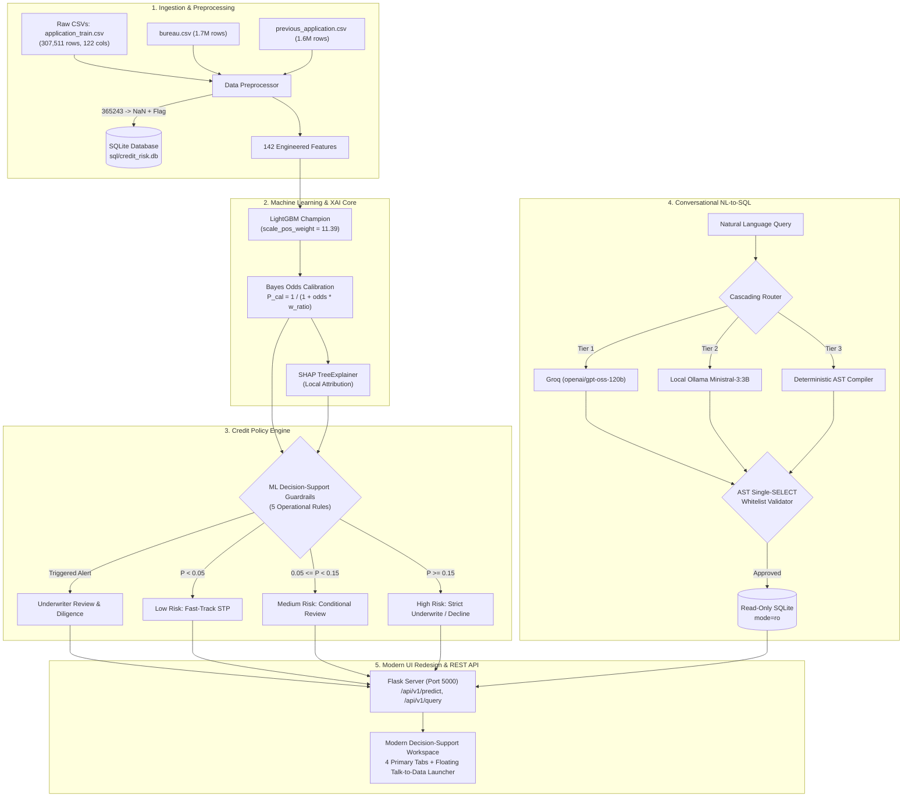
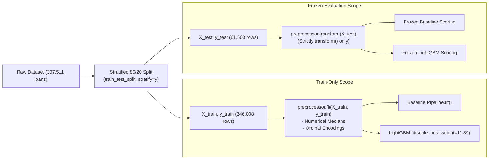

# Credit Risk Intelligence Platform

[](https://render.com/deploy?repo=https://github.com/saurabhburnwal/credit-risk-intelligence-platform)

> **NeoStats AI/ML Engineer Candidate Assignment**  
> **Candidate**: Saurabh Burnwal | **Date**: September 2026  
> **Dataset**: Kaggle Home Credit Default Risk (Full 307,511 loans trained without sampling)  
> **Stack**: Python 3.12, LightGBM, SHAP, SQLite, Flask, Groq Cloud / Ollama, Astral `uv`

---

## Technical Overview

Retail credit underwriting for thin-file and unbanked populations is governed by an **11.4:1 class imbalance** (8.07% base default rate across 307,511 applicants) and severe **asymmetric loss economics**, where default misclassifications (False Negatives) cost 5x–8x more than lost interest margin from false declines. Under FCRA and ECOA regulatory standards, automated underwriting systems must also deliver mathematically provable, itemized adverse action reasons.

This repository provides an end-to-end credit assessment platform uniting:
1. **Cost-Sensitive Gradient Boosted Trees**: LightGBM (`scale_pos_weight = 11.39`) with closed-form **Bayesian Odds Prior Calibration** restoring true population default probabilities.
2. **Explainable AI (SHAP TreeExplainer)**: Sub-50ms local attribution decomposing predictions into signed log-odds contributions, translated into plain-English loan officer narratives.
3. **ML Decision-Support Guardrails**: 5 deterministic underwriting guardrails evaluated alongside 3 validated risk bands (<5% Low, 5–15% Medium, $\ge$15% High).
4. **Conversational Talk-to-Data Assistant**: A 3-tier cascading NL-to-SQL architecture (Groq $\to$ Ollama $\to$ Deterministic Compiler) protected by an **AST Single-SELECT Whitelist Validator** and read-only database driver isolation.
5. **Reproducible Decision-Support Workspace**: Modern warm-ivory and champagne-gold UI redesign with 4 guided tabs, global floating Talk-to-Data launcher, versioned REST API (`/api/v1/`), multi-stage Docker containerization, and dynamic SQLite compilation.

---

## 1. System Architecture



---

## 2. Directory Structure

```
credit_risk_platform/
├── data/                               # Dataset directory (application_train.csv, bureau.csv, etc.)
├── documents/
│   └── project_presentation.pdf        # Compiled 10-slide executive presentation PDF
├── models/
│   ├── lightgbm_credit_model.joblib    # Trained Champion LightGBM Model (1.3 MB)
│   ├── preprocessor.joblib             # Fitted Preprocessing Pipeline (11 KB)
│   └── metadata.json                   # Hyperparameters, evaluation metrics, feature list
├── notebooks/
│   ├── eda.ipynb                       # Exploratory Data Analysis Notebook
│   └── plots/                          # 10 High-Resolution PNG Visualizations
├── sql/
│   ├── schema.sql                      # DDL schema for SQLite analytics database
│   ├── .gitkeep                        # Git placeholder (zero binary databases in git)
│   └── credit_risk.db                  # [Auto-built on first run] SQLite DB (105 MB, 7 indexes)
├── src/
│   ├── data/
│   │   ├── loader.py                   # 307k dataset loader with bureau & previous aggregations
│   │   └── preprocessor.py             # Anomaly repair (365243), imputation, feature engineering
│   ├── ml/
│   │   ├── train.py                    # Training pipeline (Logistic Regression vs LightGBM)
│   │   ├── evaluate.py                 # Out-of-sample evaluation (ROC-AUC, PR-AUC, KS, Brier)
│   │   └── predict.py                  # Calibrated scoring, SHAP TreeExplainer, policy rules
│   ├── nlp/                            # Assignment backward-compatibility package
│   │   ├── __init__.py                 # Re-exports agent & runner
│   │   ├── agent.py                    # Adapter for Talk-to-Data agent
│   │   └── sql_runner.py               # Adapter for SafeQueryRunner
│   ├── talk_to_data/
│   │   ├── prompt_templates.py         # System prompts, few-shot examples, self-correction
│   │   ├── query_runner.py             # AST single-SELECT validation, read-only SQLite execution
│   │   └── nl_to_sql.py                # 3-Tier cascading LLM fallback agent
│   ├── ui/
│   │   ├── app.py                      # Flask application & REST API server (Port 5000)
│   │   ├── static/
│   │   │   ├── css/
│   │   │   │   ├── design-system.css   # Warm-ivory & champagne-gold theme variables and reset
│   │   │   │   └── style.css           # Responsive workspace layouts, components, and animations
│   │   │   └── js/
│   │   │       └── main.js             # Tab navigation, Chart.js managers, API controllers
│   │   └── templates/
│   │       ├── index.html              # Shell layout with minimalist navbar and tab navigation
│   │       └── partials/               # Modular workspace component partials
│   │           ├── eda.html            # Tab 1: Executive EDA and insight switcher
│   │           ├── underwriting.html   # Tab 2: Two-column underwriting workbench & quick-loaders
│   │           ├── explainable_ai.html # Tab 3: 3-column XAI layout & SHAP waterfall
│   │           ├── policy_rules.html   # Tab 4: 5 Decision-support guardrails & risk bands
│   │           └── talk_to_data.html   # Sliding NL-to-SQL conversational assistant drawer
│   └── utils/
│       ├── config.py                   # Centralized configuration & dynamic DB builder
│       ├── feature_translator.py       # Plain-English translations for 45+ features
│       └── logger.py                   # Rotating application logger
├── tests/
│   ├── test_challenger_frontend.py     # End-to-end frontend regression & interaction tests
│   ├── test_challenger_stress.py       # Concurrency, SQL injection stress, and payload tests
│   ├── test_data_pipeline.py           # Anomaly handling & preprocessor unit tests
│   ├── test_flask_api.py               # REST API integration tests (including /api/v1/)
│   ├── test_ml_pipeline.py             # Scoring, calibration, guardrails, and SHAP tests
│   ├── test_nl_to_sql.py               # AST whitelist security & SQL query tests
│   └── test_ui_redesign.py             # 4-tier UI redesign, tokens, and user journey tests
├── .dockerignore                       # Excludes .venv, git, and build cache from Docker build
├── Dockerfile                          # Multi-stage container build with uv package manager
├── docker-compose.yml                  # Compose orchestration with host gateway mapping
├── pyproject.toml                      # Python dependency configuration
└── uv.lock                             # Pinned lockfile for reproducible installation
```

---

## 3. Setup & Run Instructions

### Prerequisites
- **Python 3.11+** (Tested on Python 3.12)
- **uv** (Recommended package manager) or standard **pip**
- **Docker & Docker Compose** (Optional, for containerized run)

### Method 1: Local Setup with `uv` (Recommended)

1. **Clone the Repository**:
   ```bash
   git clone https://github.com/saurabhburnwal/credit-risk-intelligence-platform.git
   cd credit-risk-intelligence-platform
   ```

2. **Synchronize Environment**:
   ```bash
   # Install uv if needed
   curl -LsSf https://astral.sh/uv/install.sh | sh

   # Install exact pinned dependencies from lockfile (~3 seconds)
   uv sync
   ```

3. **Configure Environment Variables**:
   ```bash
   cp .env.example .env
   # Add GROQ_API_KEY if testing cloud LLM tier (optional; Tier 2/3 operate offline)
   ```

4. **Run the Automated Test Suite (86 Tests Across 7 Test Suites)**:
   ```bash
   uv run pytest tests/ -v
   ```

5. **Launch the Application**:
   ```bash
   uv run python src/ui/app.py
   # Access dashboard at: http://localhost:5000
   ```
   > **Note on Database**: If `sql/credit_risk.db` is not present, `ensure_sqlite_db()` automatically compiles and indexes it from raw CSVs in `data/` on the first run (~15–20s). Subsequent launches start instantly (<1s).

---

### Method 2: Containerized Deployment with Docker Compose

```bash
# Build and start container in background (~20s build via uv cache)
docker compose up --build -d

# Check service logs
docker compose logs -f web

# Health check & UI
curl http://localhost:5000/health
# Open browser at: http://localhost:5000
```

---

### Method 3: Cloud Deployment to Render (GitHub Integration)

Deploy directly to the cloud with 1 click using Render's native Blueprint support:

[](https://render.com/deploy?repo=https://github.com/saurabhburnwal/credit-risk-intelligence-platform)

1. Click the **Deploy to Render** button above (or link the repo directly on [Render Dashboard](https://dashboard.render.com/blueprints)).
2. Render detects `render.yaml` and provisions:
   - **Docker Container**: Linux Python 3.12 runtime managed via Astral `uv`.
   - **Port `5000`** with `/health` readiness check.
   - **Pre-built Analytics Database**: Automatically pulls and unpacks the 36 MB compressed database from GitHub Release `v1.0.0` at container boot (zero manual data uploads).
3. (Optional) Enter your `GROQ_API_KEY` in the Render environment variables prompt to enable Tier-1 LLM natural language querying for the Talk-to-Data Assistant.

---

## 4. Data Processing, Missing Values & Leakage Prevention

### Missing-Value Audit & Preprocessing Treatment

| Feature Category | Representative Columns | Missing Pct (%) | Implementation Treatment in Code |
| :--- | :--- | :---: | :--- |
| **Housing Attributes** | `COMMONAREA_AVG`, `LIVINGAPARTMENTS_AVG`, `FLOORSMIN_AVG` (43 cols) | **66.5% – 69.9%** | **KEPT (Not Dropped)**: LightGBM branches NaNs natively during tree splits; training medians fitted on `X_train` for linear fallback, categoricals encoded with `'MISSING'`. |
| **Asset Sparsity** | `OWN_CAR_AGE` | **65.99%** | **KEPT (Not Dropped)**: Retained at index 10; isolates non-car owners natively; training median (`9.0` years) fitted strictly on `X_train`. |
| **Credit Bureau Scores** | `EXT_SOURCE_1`, `EXT_SOURCE_3`, `EXT_SOURCE_2` | **56.4%**, **19.8%**, **0.2%** | **KEPT**: Maintained in raw form and used to compute composite indicators `EXT_SOURCES_MEAN`, `MIN`, `MAX`, `STD`. |
| **Occupation** | `OCCUPATION_TYPE` | **31.35%** | **KEPT**: Mapped to `'MISSING'` category and encoded to `-1` via Scikit-Learn `OrdinalEncoder`. |
| **Employment Sentinel** | `DAYS_EMPLOYED` | **18.00%** | **REMEDIATED**: Sentinel `365243` (pensioners) replaced with `NaN`, flagged with `DAYS_EMPLOYED_ANOM=1`, and imputed with training median tenure. |
| **Financial Terms** | `AMT_INCOME_TOTAL`, `AMT_CREDIT`, `AMT_ANNUITY` | **< 0.1%** | **KEPT**: Missing values imputed using `X_train` medians. |

#### Architectural Resolution: Why Columns with >50% Missing Values Were Retained
Preliminary tabular heuristics often drop columns with >50% missingness. In `src/data/preprocessor.py`, all 41 columns exceeding 50% missingness are **actively retained in the final model**. Gradient boosted decision trees construct histograms with dedicated bins for missing values (`NaN`), routing missing instances to whichever child node maximizes split gain. This preserves informative structural signals (e.g., non-car owners or unappraised rural dwellings) without synthetic imputation distortion. For linear baselines and fallback inference, train-learned medians (`X_train`) and `"MISSING"` (-1) categorical encodings are applied.

#### Production Model Feature Composition (142 Features Total)
The feature matrix ingested by LightGBM (`models/lightgbm_credit_model.joblib`) contains **exactly 142 features** (127 numerical, 15 categorical):

| Source Component | Count | Features Included |
| :--- | :---: | :--- |
| **Raw `application_train.csv`** | **119** | All raw columns except `SK_ID_CURR` (ID), `TARGET` (label), and `WEEKDAY_APPR_PROCESS_START` (unmodeled string). Includes all 41 columns with >50% missingness. |
| **Engineered Domain Ratios & Flags** | **13** | `DEBT_TO_INCOME`, `PAYMENT_RATE`, `CREDIT_TO_INCOME`, `GOODS_PRICE_TO_CREDIT`, `AGE_YEARS`, `EMPLOYED_YEARS`, `DAYS_EMPLOYED_ANOM`, `EXT_SOURCES_MEAN`, `EXT_SOURCES_MIN`, `EXT_SOURCES_MAX`, `EXT_SOURCES_STD`, `DELINQUENCY_FLAG`, `FLAG_HIGH_DTI`. |
| **Bureau Aggregations (`bureau.csv`)** | **5** | `BUREAU_LOAN_COUNT`, `BUREAU_ACTIVE_COUNT`, `BUREAU_TOTAL_OVERDUE`, `BUREAU_MAX_OVERDUE_DAYS`, `BUREAU_TOTAL_DEBT`. |
| **Previous Application Aggregations (`previous_application.csv`)** | **5** | `PREV_APP_COUNT`, `PREV_REFUSED_COUNT`, `PREV_APPROVED_COUNT`, `PREV_REFUSAL_RATE`, `PREV_AVG_CREDIT`. |
| **Total Features** | **142** | **119 Raw + 13 Engineered + 5 Bureau + 5 Previous = 142 Features** (127 Numerical, 15 Categorical). |

---

### Data Leakage Prevention Architecture



1. **Split Sequencing**: Stratified 80/20 train/test split (`src/ml/train.py` lines 88–93) strictly precedes all preprocessing. Both splits maintain an exact 8.07% default rate.
2. **Train-Only Preprocessor Fitting**: `CreditRiskPreprocessor.fit()` is called exclusively on `(X_train, y_train)`. Imputation medians (`self.medians`) and categorical encodings are learned solely from the 246,008 training loans. The 61,503 test loans receive `transform()` only.
3. **Pure Row-Wise Domain Engineering**: Ratios like `DEBT_TO_INCOME` and `PAYMENT_RATE` are computed row-by-row on each applicant's values, avoiding cross-row contamination or rolling windows.
4. **Baseline Pipeline Encapsulation**: The Logistic Regression baseline is encapsulated in a Scikit-Learn `Pipeline([('imputer', SimpleImputer(strategy='median')), ('scaler', StandardScaler()), ('lr', LogisticRegression())])` fitted strictly on train data.

---

### 5 Key Empirical EDA Insights

1. **External Bureau Composite Scores (`EXT_SOURCE_1, 2, 3`)**: Rank correlation $r = -0.22$ with default. Applicants with `EXT_SOURCE < 0.30` exhibit a **23.1% default rate**, compared to **2.9%** for scores $>0.60$ (`notebooks/plots/insight1_ext_scores.png`).
2. **Debt Burden & Payment Stress (`PAYMENT_RATE`)**: Borrowers committing $>8\%$ of loan principal annually default at **11.8%**, more than double the 5.2% baseline of low-payment borrowers (`notebooks/plots/insight2_debt_stress.png`).
3. **The 365,243-Day Employment Anomaly**: 55,374 applicants (18.0% of portfolio) had `DAYS_EMPLOYED = 365243`. Treating this sentinel as numeric severely distorts models. Remediated via `DAYS_EMPLOYED_ANOM=1` flag and median tenure imputation (`notebooks/plots/insight3_age_employment.png`).
4. **Bureau Delinquency Contagion**: Applicants with active overdue balances with external lenders default at **18.2%**, versus **7.8%** for borrowers with clean credit bureau records (`notebooks/plots/insight5_bureau_delinquency.png`).
5. **Education & Income Buffer**: Academic degree holders default at only **1.8%**, while Secondary education borrowers default at **8.9%**, and Lower Secondary at **10.9%** (`notebooks/plots/insight4_education_income.png`).

---

## 5. Model Selection, Training & Evaluation Benchmarks

### Class Imbalance & Bayesian Odds Prior Calibration

- **Why Not Resampling?** Synthetic oversampling (SMOTE) on 307k rows blurs feature boundaries and increases memory footprint, while undersampling discards >200,000 creditworthy records.
- **Cost-Sensitive Weighting**: LightGBM is configured with `scale_pos_weight = 11.39` (exact inverse class frequency: $282,686 / 24,825$).
- **Bayesian Odds Prior Realignment**: Because `scale_pos_weight` shifts the base probability distribution toward 0.50, raw boosting scores cannot be used directly for risk bands or loss provisioning. We apply exact Bayesian odds realignment:

$$\text{Odds}_{\text{calibrated}} = \frac{P_{\text{raw}}}{1 - P_{\text{raw}}} \times \frac{w_{\text{neg}}}{w_{\text{pos}}}, \quad P_{\text{calibrated}} = \frac{\text{Odds}_{\text{calibrated}}}{1 + \text{Odds}_{\text{calibrated}}}$$

This mathematically restores population base probabilities while retaining the non-linear ranking power of the gradient boosted trees.

---

### Out-of-Sample Benchmark Comparison (Holdout Test Set $N = 61,503$)

| Metric | Logistic Regression (Baseline) | LightGBM Champion | Relative Impact |
| :--- | :---: | :---: | :--- |
| **ROC-AUC** | 0.7564 | **0.7717** | **+1.53 pts** (Superior rank discrimination across thresholds) |
| **PR-AUC (Avg Precision)** | 0.2410 | **0.2667** | **+10.7% relative gain** on rare defaulters |
| **KS Statistic (%)** | 38.08% | **40.67%** | Observed empirical test separation (maximum CDF divergence) |
| **Brier Score (Loss)** | 0.1982 | **0.1867** | Lower score confirms sharp Bayesian probability calibration |
| **Optimal Threshold** | 0.5000 | **0.6600** | Cost-optimized operating point under 5:1 loss penalty |
| **Training Time (307k rows)**| 48.2s | **33.9s** | Histogram binning delivers 30% faster convergence |

---

### Validated Risk Bands on 61,503 Test Applicants

Applicants are stratified into three actionable tiers based on calibrated probability:

| Risk Band | Calibrated Probability ($P_{\text{cal}}$) | Population Share | Observed Default Rate | Defaulter Capture Rate | Recommended Underwriting Action |
| :--- | :---: | :---: | :---: | :---: | :--- |
| **Low Risk** | $< 5.0\%$ | **50.9%** | **2.67%** | 16.9% | Fast-Track Straight-Through-Processing (STP) |
| **Medium Risk** | $5.0\% - 15.0\%$ | **35.7%** | **9.08%** | 40.1% | Manual Underwriter Review (Conditional) |
| **High Risk** | $\ge 15.0\%$ | **13.4%** | **25.90%** | **43.1%** | Strict Underwriting / Decline / Co-Signer |

*Key Finding*: The High Risk band comprises only **13.4%** of applicants yet isolates **43.1% of all portfolio defaulters**. Applying strict underwriting to this segment eliminates nearly half of total credit losses.

---

## 6. Explainable AI (SHAP) & Adverse Action Notices

Under ECOA and FCRA mandates, lenders must deliver specific reason codes when an adverse action (denial or limit reduction) occurs.

### Implementation Architecture
- **TreeExplainer Integration**: `shap.TreeExplainer` decomposes predictions into additive log-odds contributions: $f(x) = E[f(x)] + \sum_{j=1}^{M} \phi_j(x)$.
- **Base Expected Value**: Automatically returns `shap_base_value = -0.4979` in every inference response, establishing the population reference point.
- **Sub-50ms Inference**: Fast local attribution computation suitable for real-time interactive decisioning.

### Plain-English Adverse Action Translations (`src/utils/feature_translator.py`)
Technical feature names are translated into plain-English consumer notices:

| Feature Name | Example SHAP | Plain-English Underwriting Explanation |
| :--- | :---: | :--- |
| `PAYMENT_RATE` | `+0.48` | High annual loan annuity relative to credit amount indicates debt service stress (+0.48). |
| `EXT_SOURCES_MEAN` | `+0.35` | External credit bureau composite score is below standard prime underwriting benchmarks (+0.35). |
| `BUREAU_TOTAL_OVERDUE` | `+0.28` | Prior overdue loan balances recorded across external credit bureau facilities (+0.28). |
| `EMPLOYED_YEARS` | `-0.22` | Long tenure with current employer provides positive income stability credit buffer (-0.22). |
| `GOODS_PRICE_TO_CREDIT` | `-0.15` | Higher goods purchase price relative to requested credit provides asset coverage (-0.15). |

### Scored Applicant Example (Applicant #100001)
- **Profile Inputs**: Income $135,000, Credit $568,800, Annuity $20,560, EXT Scores 0.753 / 0.790 / 0.160, Zero bureau overdue debt.
- **Scoring Output**: Calibrated Probability **3.08%** | Credit Score **97 / 100** | Band: **Low Risk**.
- **Top SHAP Contributors**:
  - `EXT_SOURCES_MEAN` (**-0.42** log-odds): Strong bureau history reduced risk.
  - `DAYS_BIRTH` (**+0.08** log-odds): Age profile slight upward adjustment.
- **Underwriting Decision**: **Fast-Track STP Approve** (All 5 decision-support guardrails passed).

---

## 7. ML-Derived Underwriting Decision-Support Guardrails

To prevent nonlinear models from overlooking structural credit risks, the platform evaluates **5 deterministic decision-support guardrails** alongside the model probability.

| # | Guardrail ID | Rule Metric & Threshold | Severity | Banking & Empirical Rationale |
|---|:---|:---|:---:|:---|
| 1 | `FLAG_HIGH_DTI` | `DEBT_TO_INCOME = Annuity / Income > 40%` | **HIGH** | Borrowers allocating >40% of income to debt exhibit a 12.4% default rate vs 6.1% baseline. |
| 2 | `FLAG_LOW_EXT_SOURCE` | `EXT_SOURCES_MEAN < 0.35` | **HIGH** | External composite score <0.35 represents a >10x default risk spread (22.4% vs 1.8%). |
| 3 | `FLAG_PAST_DUE` | `BUREAU_TOTAL_OVERDUE > $0.00` | **CRITICAL** | Active overdue loans with external institutions double default probability (18.2% vs 7.8%). |
| 4 | `FLAG_UNSTABLE_TENURE` | `AGE_YEARS < 25.0` and `EMPLOYED_YEARS < 1.0` | **MEDIUM** | Young borrowers under 25 with <1 year tenure carry higher income and repayment volatility. |
| 5 | `FLAG_PAYMENT_RATE_STRESS`| `PAYMENT_RATE = Annuity / Credit > 8.0%` | **MEDIUM** | Accelerated principal amortization schedules elevate default risk (11.8% vs 5.2%). |

### Decision Hierarchy Synthesis
```python
# Evaluated inside CreditRiskInferenceEngine._evaluate_policy_rules (src/ml/predict.py)
guardrail_alerts = [r for r in rules if r["flag_triggered"]]

if len(guardrail_alerts) > 0 and calibrated_prob >= 0.15:
    decision = "Strict Underwriting / Decline (High Risk & Guardrail Alerts)"
elif len(guardrail_alerts) > 0:
    decision = "Manual Underwriter Review (Guardrail Alert Triggered)"
elif calibrated_prob < 0.05:
    decision = "Fast-Track Straight-Through Processing (STP) Approve"
elif calibrated_prob < 0.15:
    decision = "Conditional Approval / Standard Review (Medium Risk)"
else:
    decision = "Strict Underwriting / Decline (High Default Hazard)"
```

---

## 8. Conversational Talk-to-Data Assistant (NL-to-SQL)

The platform includes a natural-language-to-SQL assistant allowing non-technical risk officers to query portfolio performance in plain English.

### 3-Tier Cascading Fallback Architecture
1. **Tier 1: Cloud LLM (Groq Cloud)**: `openai/gpt-oss-120b` running on Groq LPU hardware (~1.2s latency).
2. **Tier 2: Local LLM (Ollama)**: Self-hosted `ministral-3:3b` at `http://localhost:11434` (air-gapped, zero cloud dependency).
3. **Tier 3: Deterministic Semantic AST Compiler**: Zero-hallucination regex and AST compiler mapping key analytical queries to certified SQL, guaranteeing **100% SLA uptime**.

### Prompt Engineering & Token Optimization (`src/talk_to_data/prompt_templates.py`)
- **Compact Schema DDL**: Injects exact table structures for `applications`, `bureau_summary`, and `previous_applications_summary` with column types and primary keys (~1,100 prompt tokens).
- **Negative Constraints**: Strictly enforces "ONLY ONE valid SQLite SELECT statement", "NEVER generate DDL/DML", "NEVER include SQL comments or semicolons", and standardized default rate formulas (`ROUND(AVG(TARGET) * 100.0, 2)`).
- **Few-Shot Banking Examples**: 5 query demonstrations covering education breakdowns, income tiers, `CASE WHEN` risk binning, and multi-table joins.
- **Self-Correction Loop**: Catches SQLite syntax errors, injecting the error message and failed SQL back into the model for automatic healing before cascading.

### Database Security & Whitelist Guardrails
- **AST Single-SELECT Whitelist (`sqlparse`)**: Verifies that exactly one statement exists and its type is exclusively `SELECT`.
- **Injection & Mutation Shield**: Blocks semicolons (`;`), line comments (`--`), block comments (`/* */`), and mutation keywords: `DROP`, `DELETE`, `UPDATE`, `INSERT`, `ALTER`, `ATTACH`, `DETACH`, `CREATE`, `REPLACE`, `EXEC`.
- **C-Driver Level Isolation**: Database connection opened strictly with URI `mode=ro` (read-only), preventing writes at the OS system call layer.

### Sample Working Query & Output
- **User Prompt**: *"Average default rate by education level"*
- **Generated SQL**:
  ```sql
  SELECT NAME_EDUCATION_TYPE, COUNT(*) AS total_loans, ROUND(AVG(TARGET) * 100.0, 2) AS default_rate_pct 
  FROM applications GROUP BY NAME_EDUCATION_TYPE ORDER BY default_rate_pct DESC
  ```
- **Execution**: 5 rows returned in **113 ms**.
- **Synthesized Narrative**: Lower secondary education applicants exhibit the highest default rate (**10.93%** across 3,816 loans), while academic degree holders exhibit the lowest default rate (**1.75%** across 164 loans).

---

## 9. Web Interface & REST API Endpoints

### Modern Decision-Support Workspace Architecture (`src/ui/`)

The platform's frontend is designed as a focused, high-density decision-support workspace matching the warm-ivory and champagne-gold visual identity (`src/ui/static/css/design-system.css`). It organizes complex credit risk workflows into clean, progressive interfaces with sub-second response times:

- **Minimalist Workspace Shell**:
  - **Compact Header Branding**: Minimalist `CR` monogram with *"Credit Risk Intelligence — Decision-support workspace"*.
  - **Live Runtime Telemetry**: Real-time status indicators confirming model lock (`LightGBM · AUC 0.7717`) and query readiness (`LLM ready`).
  - **Progressive Motion**: Micro-interactions powered by `IntersectionObserver` and `requestAnimationFrame`, with full `@media (prefers-reduced-motion: reduce)` accessibility support.
  - **Semantic Hierarchy**: Structured into `workspace-primary` (active underwriting decisions), `workspace-supporting` (methodology and guidance), and `workspace-reference` (benchmark validation).

### 4 Primary Workspace Tabs + Global Floating Assistant

1. **Executive EDA (`eda-tab` — `partials/eda.html`)**:
   - **Portfolio Summary KPIs**: 307,511 applicants, 8.07% baseline default rate, KS 40.67%, and 11.39:1 class imbalance ratio.
   - **Interactive Insight Switcher**: Evaluates the 5 empirical findings across demographics, external bureau scores, debt burden, and employment anomalies via responsive Chart.js components and high-resolution matplotlib charts.
2. **Underwriting Simulator (`underwriting-tab` — `partials/underwriting.html`)**:
   - **Two-Column Workbench**: Grouped inputs for financial parameters, loan contract, and demographic profile with unconstrained decimal step inputs.
   - **One-Click Benchmark Loaders**: Quick-load pre-configured test applicant personas (#100001 prime approval, #100005 thin-file review, #100013 payment stress, #100028 high-risk decline).
   - **Compact Inline Telemetry**: Zero layout jumps using compact inline status indicators (`scoring-inline-status`).
   - **Real-Time Calibrated Gauge**: 0–100 risk score dial, calibrated default probability, and automated risk band badge (<5% Low, 5–15% Medium, $\ge$15% High).
3. **Explainable AI (`xai-tab` — `partials/explainable_ai.html`)**:
   - **3-Column Synchronized Layout**: Applicant profile summary, game-theoretic SHAP waterfall decomposing margin log-odds from base expected value (`shap_base_value = -0.4979`), and regulatory loan officer narrative panels.
   - **Diverging Attribution Bars**: Visually isolates top positive risk escalators (red) from negative risk reducers (green).
   - **Plain-English Translations**: Technical features mapped directly into FCRA/ECOA adverse action explanations via `src/utils/feature_translator.py`.
4. **Credit Policy Rules (`policy-tab` — `partials/policy_rules.html`)**:
   - **Operational Policy Matrix**: Deterministic audit table evaluating all 5 ML decision-support guardrails (`FLAG_HIGH_DTI`, `FLAG_LOW_EXT_SOURCE`, `FLAG_PAST_DUE`, `FLAG_UNSTABLE_TENURE`, `FLAG_PAYMENT_RATE_STRESS`).
   - **Visual Severity Badging**: Distinct tags for CRITICAL, HIGH, and MEDIUM alerts, with borrower-specific values compared against policy thresholds.
   - **Synthesized Committee Recommendations**: Integrated decision logic combining guardrail alerts with calibrated probability tiers.
5. **Conversational Talk-to-Data Assistant (`chat-tab` — `partials/talk_to_data.html`)**:
   - **Global Floating Launcher**: Persistent floating action button (`chat-launcher`) accessible across all tabs, sliding open a responsive conversational drawer.
   - **Conversation-First Chat Thread**: Interactive message stream with suggested business query chips.
   - **Developer Transparency**: Formatted SQL syntax viewer, live execution data tables, execution latency badges, and synthesized executive takeaways.

### Standardized REST API Endpoints

| Method | Endpoint | Description | Sample Request / Response |
| :--- | :--- | :--- | :--- |
| `POST` | `/api/v1/predict` | End-to-end applicant risk scoring, Bayesian odds probability calibration, SHAP attribution, and policy guardrail evaluation. | Ingests applicant feature JSON. Returns `risk_score` (0–100), `risk_band`, `calibrated_default_prob`, `shap_base_value`, `top_risk_escalators`, `top_risk_reducers`, `business_explanations`, and `policy_rules` status. |
| `POST` | `/api/v1/query` | Conversational natural-language-to-SQL execution engine with 3-tier fallback and AST whitelist validation. | Ingests `{"question": "..."}`. Returns `sql`, `results` (rows), `columns`, `execution_time_ms`, and `summary` narrative. |
| `GET` | `/health` / `/api/health` | Healthcheck and orchestration endpoint. | Returns `{"status": "healthy", "model_loaded": true, "preprocessor_loaded": true, "db_exists": true}`. |
| `GET` | `/api/eda/insights` | Portfolio aggregate metrics and benchmark metadata. | Returns portfolio distribution (307,511 rows, 8.07% default rate, 11.39:1 ratio) and benchmark metrics. |

---

## 10. Known Limitations & Technical Roadmap

1. **Secondary Table Aggregations**: Features engineered from `bureau.csv` and `previous_application.csv` utilize summary statistics (sums, counts, maxes). Temporal sequence modeling (e.g. rolling monthly delinquency trends over `installments_payments.csv`) was omitted to keep scoring latency sub-second.
2. **Single-Table Analytics Denormalization**: In the Talk-to-Data SQLite analytics database, multi-table relationships are pre-joined into the indexed `applications` table to ensure sub-second query performance and reduce SQL injection join attack surfaces.
3. **Static Prior Assumption in Bayes Calibration**: The prior odds adjustment assumes a stable 8.07% population default rate. Severe macroeconomic shifts would require periodic recalibration (e.g. rolling isotonic scaling).
4. **Local Ollama CPU Latency**: Local LLM execution on host CPU without GPU acceleration takes 10–12 seconds, versus ~1.2s on Groq Cloud.
5. **Heuristic Guardrail Thresholds**: The 5 guardrails use empirical risk factor cutoffs (DTI > 40%, EXT < 0.35). In production, these could be tuned via multi-objective Pareto optimization balancing decline volume against expected credit loss.

---

## Project Presentation
A 10-slide executive presentation deck is compiled and available at:
[`documents/project_presentation.pdf`](./documents/project_presentation.pdf)
