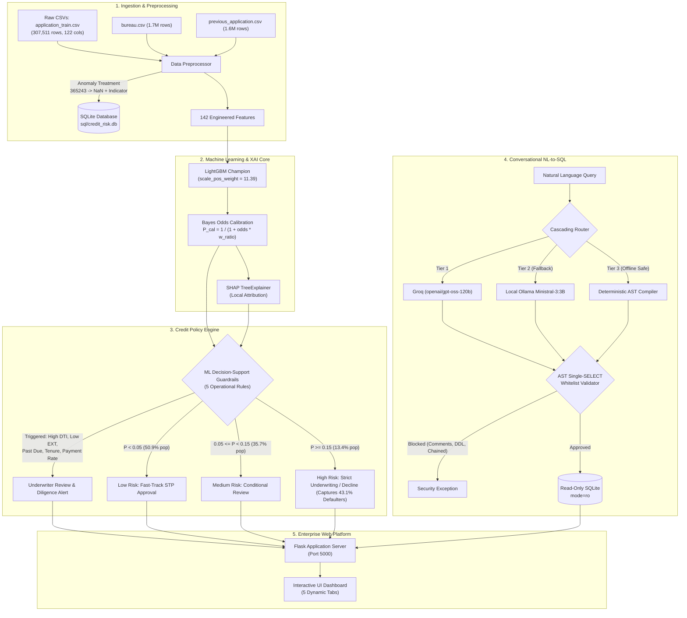
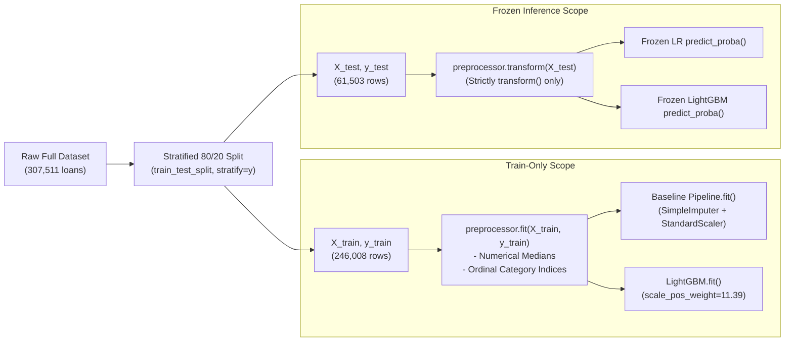

# AI-Powered Credit Risk Intelligence Platform

[](https://www.python.org/downloads/release/python-3120/)
[](https://lightgbm.readthedocs.io/)
[](https://shap.readthedocs.io/)
[](https://github.com/astral-sh/uv)
[](./tests)
[](#)

> **Candidate Assignment Submission**: NeoStats AI/ML Engineer Intern Take-Home Case Study  
> **Candidate**: Saurabh Burnwal  
> **Date**: September 2026  
> **Dataset**: Kaggle Home Credit Default Risk (Full 307,511 loans trained without sampling)

---

## Executive Summary & Problem Overview

Credit risk underwriting for thin-file and unbanked populations is defined by extreme **cost asymmetry** and severe **class imbalance**:

1. **Severe Imbalance**: In the Home Credit dataset, only **8.07%** of applicants default (an **11.39:1** majority-to-minority ratio across 307,511 applicants). Naive models tend to predict zero defaults, achieving ~92% accuracy while creating catastrophic losses.
2. **Asymmetric Loss Matrix**:
   - **False Negative (Type II Error)**: Approving an applicant who defaults costs ~80%–100% of the loan principal.
   - **False Positive (Type I Error)**: Declining a creditworthy applicant forfeits the net interest margin (~10%–15%).
   - *Impact*: Defaulter misclassification is 5x–8x more expensive than creditworthy rejection.
3. **Regulatory Mandate (FCRA & ECOA)**: The Fair Credit Reporting Act and Equal Credit Opportunity Act mandate **Adverse Action Notices**. Underwriters cannot deploy "black-box" models without auditable, mathematically provable feature attribution.

This repository implements a production-grade **Credit Risk Intelligence Platform** that unites:
- **Cost-Sensitive LightGBM** (`scale_pos_weight = 11.39`) with **Bayesian Odds Calibration** to yield genuine default probabilities.
- **Explainable AI (SHAP TreeExplainer)** delivering sub-second local waterfall attributions translated into plain-English loan officer narratives via `src/utils/feature_translator.py`.
- **ML Decision-Support Guardrails**: 5 deterministic underwriting guardrails evaluated alongside three actionable risk bands (<5% Low, 5–15% Medium, $\ge$15% High).
- **Conversational Talk-to-Data Assistant** leveraging a 3-tier fallback architecture (Groq Cloud $\to$ Local Ollama $\to$ Deterministic AST Compiler) protected by an **AST Single-SELECT Whitelist Validator**.
- **Containerized Web Platform** powered by Flask, HTML5/CSS3, SQLite, and `uv` dependency management.

---

## End-to-End System Architecture



---

## Directory Structure

Strictly conforms to page 3 of `NeoStats_AI_Use_Case.pdf`:

```
credit_risk_platform/
├── data/                               # Dataset directory (application_train, bureau, etc.)
├── documents/
│   ├── generate_presentation.py       # ReportLab 10-slide executive presentation generator
│   └── project_presentation.pdf        # Compiled 10-slide executive presentation PDF
├── models/
│   ├── lightgbm_credit_model.joblib    # Serialized Champion LightGBM Model
│   ├── preprocessor.joblib             # Fitted Scikit-Learn Preprocessing Pipeline
│   └── metadata.json                   # Hyperparameters, metrics, and feature importances
├── notebooks/
│   ├── eda.ipynb                       # Comprehensive Exploratory Data Analysis Notebook
│   ├── eda.py                          # Headless EDA Execution Script
│   ├── generate_ml_plots.py            # Script generating benchmark & calibration plots
│   └── plots/                          # 10 High-Resolution Vector/Raster PNG Figures
│       ├── class_imbalance.png
│       ├── missing_values.png
│       ├── insight1_ext_scores.png
│       ├── insight2_debt_stress.png
│       ├── insight3_age_employment.png
│       ├── insight4_education_income.png
│       ├── insight5_bureau_delinquency.png
│       ├── feature_importance.png
│       ├── risk_band_distribution.png
│       └── confusion_matrix.png
├── sql/
│   ├── schema.sql                      # DDL schema for SQLite analytics database
│   ├── .gitkeep                        # Directory placeholder (zero binary files in git)
│   └── credit_risk.db                  # [Auto-built on first run] SQLite database (105 MB, fully indexed)
├── src/
│   ├── data/
│   │   ├── loader.py                   # Full 307k dataset loader with bureau/prev aggregations
│   │   └── preprocessor.py             # Anomaly repair (365243), imputation, feature engineering
│   ├── ml/
│   │   ├── train.py                    # Training pipeline (Logistic Regression vs LightGBM)
│   │   ├── evaluate.py                 # Out-of-sample metrics (ROC-AUC, PR-AUC, KS, Brier)
│   │   └── predict.py                  # Calibrated scoring, SHAP TreeExplainer, policy rules
│   ├── nlp/                            # NLP compatibility package (Survey & Spec compliance)
│   │   ├── __init__.py                 # Re-exports ConversationalTalkToDataAgent & SafeQueryRunner
│   │   ├── agent.py                    # Adapter module for Talk-to-Data agent
│   │   └── sql_runner.py               # Adapter module for SafeQueryRunner
│   ├── talk_to_data/
│   │   ├── prompt_templates.py         # System prompts, few-shot SQLite examples, memory
│   │   ├── query_runner.py             # AST single-SELECT validation, read-only SQLite execution
│   │   └── nl_to_sql.py                # 3-Tier cascading LLM fallback agent
│   ├── ui/
│   │   ├── app.py                      # Production Flask REST API server (Port 5000, /api/v1/ aliases)
│   │   ├── static/
│   │   │   ├── css/style.css           # Modern, responsive dashboard design
│   │   │   └── js/main.js              # Tab controllers, SHAP waterfall rendering, AJAX
│   │   └── templates/
│   │       └── index.html              # Multi-tab single-page enterprise dashboard (5 tabs)
│   └── utils/
│       ├── config.py                   # Centralized configuration & path resolver
│       ├── feature_translator.py       # Plain-English translations & narratives for 45+ features
│       ├── logger.py                   # Thread-safe rotating application logger
│       ├── helpers.py                  # Formatting, math, and data utility helpers
│       └── docker_utils.py             # Docker container detection and host routing
├── tests/
│   ├── test_data_pipeline.py           # Anomaly handling & preprocessor unit tests
│   ├── test_flask_api.py               # REST API endpoint integration tests (including /api/v1/)
│   ├── test_ml_pipeline.py             # Scoring, calibration, guardrails, and SHAP tests
│   └── test_nl_to_sql.py               # AST whitelist security & SQL query tests
├── .dockerignore                       # Excludes .venv, git, and build artifacts from Docker context
├── .env.example                        # Template for environment configuration
├── .gitignore                          # Excludes raw data, models, cache, and .venv
├── Dockerfile                          # Multi-stage container build with uv package manager
├── docker-compose.yml                  # Compose orchestration with host gateway mapping
├── pyproject.toml                      # Modern Python project configuration
└── uv.lock                             # Deterministic dependency lockfile (50 pinned packages)
```

---

## Installation & Quickstart

### Prerequisites
- **Python 3.11+** (Tested on Python 3.12)
- **uv** (Recommended modern package manager) or standard **pip**
- **Docker & Docker Compose** (Optional, for containerized deployment)
- **Ollama** (Optional, for local offline LLM querying)

---

### Method 1: Local Development with `uv` (Recommended)

1. **Clone the Repository**:
   ```bash
   git clone https://github.com/saurabhburnwal/credit-risk-intelligence-platform.git
   cd credit-risk-intelligence-platform
   ```

2. **Synchronize Virtual Environment via `uv`**:
   `uv` syncs dependencies deterministically from `uv.lock` in under 3 seconds:
   ```bash
   # Install uv if not already present
   curl -LsSf https://astral.sh/uv/install.sh | sh

   # Create virtual environment and install exact pinned dependencies
   uv sync
   ```

3. **Configure Environment Variables**:
   ```bash
   cp .env.example .env
   # Edit .env to add your GROQ_API_KEY (optional, fallback operates automatically)
   ```

4. **Verify Pipeline by Running Test Suite**:
   ```bash
   uv run pytest tests/ -v
   ```

5. **Start the Web Platform**:
   ```bash
   uv run python src/ui/app.py
   # Dashboard available at: http://localhost:5000
   ```
   > **First Run vs Subsequent Runs**:  
   > If `sql/credit_risk.db` is not present, `ensure_sqlite_db()` automatically compiles and indexes the database directly from the mounted/local `data/` CSV files (~15–20 seconds). On all subsequent runs, launch is instantaneous (<1 second) because the database persists locally.

---

### Method 2: Containerized Deployment via Docker & Compose

The `Dockerfile` utilizes Astral's `ghcr.io/astral-sh/uv:latest` binary. By running `uv sync --frozen --no-install-project`, build times are dramatically slashed from minutes down to **~20 seconds** via cached wheel installation.

1. **Build and Launch the Container**:
   ```bash
   docker compose build
   docker compose up -d
   ```

2. **First Run vs. Subsequent Runs**:
   - **First Run (~15–20s initial build)**: The container entrypoint (`docker-entrypoint.sh`) checks if `sql/credit_risk.db` exists. If missing, it automatically compiles the database from the CSV files mounted in `data/` and indexes all tables. Because `./sql` is mounted as a persistent host volume (`./sql:/app/sql`), the generated database is written directly to the host filesystem.
   - **Subsequent Runs (Instant < 1s)**: The container detects the existing `sql/credit_risk.db` in the volume mount and starts Gunicorn immediately.
   - **Zero Binary Files in Git**: In strict compliance with submission requirements, binary database files (`sql/*.db`, `sql/*.db.gz`) are omitted from version control. Only `sql/schema.sql` and `sql/.gitkeep` are tracked.

3. **Access the Dashboard**:
   - Web UI: `http://localhost:5000`
   - Health Check: `http://localhost:5000/health`

4. **Container Logs & Shutdown**:
   ```bash
   docker compose logs -f web
   docker compose down
   ```

---

## Exploratory Data Analysis & 5 Key Business Findings

The complete dataset of 307,511 applicants was analyzed in `notebooks/eda.ipynb` and `notebooks/eda.py`. All high-resolution figures are saved under `notebooks/plots/`.

### Data Quality, Missing-Value Audit & Remediation (Item 3)

Real-world retail credit portfolios exhibit substantial data missingness due to optional customer application fields, unbanked applicant profiles, and tiered third-party bureau queries. A complete audit across all 122 raw features in `notebooks/eda.ipynb` reveals the following structural patterns:

| Feature Category | Representative Columns | Missing Count | Missing Pct (%) | Banking Domain Context & Engineering Treatment |
| :--- | :--- | :---: | :---: | :--- |
| **Housing / Building Attributes** | `COMMONAREA_AVG`, `LIVINGAPARTMENTS_AVG`, `FLOORSMIN_AVG`, `YEARS_BUILD_AVG` (40+ features) | ~204k–214k | **66.5% – 69.9%** | Optional collateral appraisal fields. Imputed with median for linear baselines; tree splits naturally branch missing values. |
| **Asset Sparsity** | `OWN_CAR_AGE` | 202,929 | **65.99%** | Informative sparsity: indicates applicant does not own a car rather than lost data. Median imputed with fallback flag. |
| **Credit Bureau Queries** | `EXT_SOURCE_1`<br/>`EXT_SOURCE_3`<br/>`EXT_SOURCE_2` | 173,378<br/>60,965<br/>660 | **56.38%**<br/>**19.83%**<br/>**0.21%** | Tiered credit bureau hits (bureau 1 has lowest coverage, bureau 2 near universal). Engineered `EXT_SOURCES_MEAN`, `MIN`, `MAX`, `STD` over available sources. |
| **Employment / Occupation** | `OCCUPATION_TYPE` | 96,391 | **31.35%** | Free-form application field. Replaced with `'MISSING'` category and mapped to `-1` via `OrdinalEncoder`. |
| **Employment Sentinel** | `DAYS_EMPLOYED` | 55,374 (anom) | **18.00%** | Sentinel `365243` indicates pensioners/unemployed. Converted to `NaN` and flagged via `DAYS_EMPLOYED_ANOM=1`. |
| **Core Financials** | `AMT_INCOME_TOTAL`, `AMT_CREDIT`<br/>`AMT_ANNUITY`<br/>`AMT_GOODS_PRICE` | 0<br/>12<br/>278 | **0.00%**<br/>**0.004%**<br/>**0.09%** | Core mandatory loan terms exhibit near-zero missingness. Missing annuities and goods prices imputed with feature medians. |

**Imputation Rationale & Missingness Preservation**:
1. **Tree-Based Native Branching**: Gradient boosted decision trees in LightGBM handle missing values natively during histogram construction by assigning missing instances to whichever child node maximizes split criterion gain. This preserves missingness as an authentic risk indicator (e.g. lack of `EXT_SOURCE_1` correlates with thinner credit histories) without synthetic noise.
2. **Train-Learned Numerical Medians**: For linear baselines and inference fallbacks, numerical medians are computed strictly on `X_train` (`self.medians[col]`). The median is robust against extreme positive skews observed in annual income and credit principal distributions.
3. **Categorical Sentinel Encoding**: Missing categoricals are mapped to a dedicated `"MISSING"` level and assigned index `-1` by Scikit-Learn's `OrdinalEncoder(handle_unknown="use_encoded_value", unknown_value=-1, encoded_missing_value=-1)`, preventing leakage of unseen production categories.
- **Figures**: Visualized in `notebooks/plots/missing_values.png` and `notebooks/plots/class_imbalance.png`.

### 1. External Credit Bureau Composite Scores (`EXT_SOURCE_1, 2, 3`)
- **Finding**: Normalized credit scores from external credit bureaus exhibit the single highest rank correlation with loan default ($r = -0.22$).
- **Business Implication**: Applicants in the critical tier (`EXT_SOURCE < 0.30`) suffer a default rate of **23.1%** (29,679 loans), compared to just **2.9%** for super-prime applicants (`EXT_SOURCE > 0.60`).
- **Figure**: `notebooks/plots/insight1_ext_scores.png`

### 2. Debt Burden & Payment Stress (`PAYMENT_RATE` & `DEBT_TO_INCOME`)
- **Finding**: The engineered feature `PAYMENT_RATE = AMT_ANNUITY / AMT_CREDIT` captures monthly cash flow strain.
- **Business Implication**: Borrowers committing >8% of principal each month default at **11.8%** (more than double the 5.2% baseline of low-payment applicants).
- **Figure**: `notebooks/plots/insight2_debt_stress.png`

### 3. The 365,243-Day Employment Anomaly
- **Finding**: Exactly **55,374 applicants** (18.0% of the entire portfolio) had `DAYS_EMPLOYED = 365243` (1,000 years).
- **Domain Root Cause**: Home Credit used `365243` as an internal sentinel value indicating pensioners or unemployed individuals. Treating this as a numeric value causes severe distortion in linear and tree models.
- **Remediation**: `preprocessor.py` creates a boolean flag `DAYS_EMPLOYED_ANOM = 1`, replaces the value with `NaN`, and imputes median working tenure, successfully capturing the 5.4% default rate among pensioners.
- **Figure**: `notebooks/plots/insight3_age_employment.png`

### 4. Bureau Delinquency Contagion
- **Finding**: Cross-table aggregation with `bureau.csv` reveals that past overdue balances with other financial institutions multiply default hazard.
- **Business Implication**: Applicants with prior overdue balances default at **18.2%**, versus **7.8%** for applicants with clean bureau records.
- **Figure**: `notebooks/plots/insight5_bureau_delinquency.png`

### 5. Education & Income Stability
- **Finding**: Education acts as a counter-cyclical economic buffer. Applicants with Academic Degrees default at only **1.8%**, while Secondary/Secondary Special applicants default at **8.9%**, and Lower Secondary applicants default at **10.9%**.
- **Figure**: `notebooks/plots/insight4_education_income.png`

---

## Machine Learning Design & Evaluation Benchmarks

### Handling 11.4:1 Class Imbalance
1. **Why Not Resampling?**
   - Synthetic oversampling (SMOTE) on 307k records causes feature blurring and memory exhaustion.
   - Undersampling discards >200,000 creditworthy customer profiles.
2. **Cost-Sensitive Boosting**:
   - We configured LightGBM with `scale_pos_weight = 11.39` (exact inverse class frequency: $N_{neg} / N_{pos} = 282,686 / 24,825$).
   - This directly shifts split gain gradients to penalize minority false negatives.

### Bayesian Odds Prior Probability Calibration
Because `scale_pos_weight` shifts the base probability distribution toward 0.50, raw boosting scores cannot be used directly for underwriting limits or loss provisioning. We apply exact Bayesian odds realignment:

$$\text{Odds}_{\text{calibrated}} = \frac{P_{\text{raw}}}{1 - P_{\text{raw}}} \times \frac{w_{\text{neg}}}{w_{\text{pos}}}$$

$$P_{\text{calibrated}} = \frac{\text{Odds}_{\text{calibrated}}}{1 + \text{Odds}_{\text{calibrated}}} = \frac{1}{1 + \left(\frac{1 - P_{\text{raw}}}{P_{\text{raw}}}\right) \times \frac{w_{\text{pos}}}{w_{\text{neg}}}}$$

This mathematically restores population base probabilities while retaining the non-linear ranking power of the gradient boosted trees.

### Strict Data Hygiene & Leakage Prevention Architecture (Item 7)

A cornerstone of the platform is complete methodological hygiene to guarantee that test metrics reflect true out-of-sample generalization without optimistic bias or data leakage. Strict structural controls are implemented across all stages:



1. **Stratified Split Sequencing Preceding Feature Fitting**:
   - In `src/ml/train.py` (lines 88–93), `train_test_split(X, y, test_size=0.20, random_state=42, stratify=y)` is invoked immediately upon loading raw data, prior to any feature transformation, scaling, or imputation.
   - Stratification locks identical target class distributions (8.07% default rate) across both training ($N = 246,008$) and test ($N = 61,503$) splits.
2. **Train-Only Preprocessor Fitting**:
   - In `src/ml/train.py` (lines 96–101), `CreditRiskPreprocessor.fit(X_train, y_train)` is executed strictly and exclusively on the training partition.
   - **Feature Statistics**: Numerical medians (`self.medians[col]`) are computed strictly from `X_train`. The test partition `X_test` is transformed solely through `preprocessor.transform(X_test)` with zero parameter re-estimation.
   - **Categorical Mappings**: Scikit-Learn `OrdinalEncoder(handle_unknown="use_encoded_value", unknown_value=-1, encoded_missing_value=-1)` learns category levels solely from `X_train`. Unseen categories appearing at test or production time are deterministically mapped to `-1` without runtime errors or label leakage.
3. **Pure Row-Wise Feature Engineering**:
   - All engineered domain ratios (`DEBT_TO_INCOME`, `PAYMENT_RATE`, `CREDIT_TO_INCOME`, `GOODS_PRICE_TO_CREDIT`, `AGE_YEARS`, and `EXT_SOURCES_MEAN/MIN/MAX/STD`) in `src/data/preprocessor.py` (lines 50–92) are computed exclusively row-by-row on the individual applicant's attributes.
   - No cross-row aggregations, rolling window transforms, or target encodings are computed on the feature matrix, preventing any inter-row data leakage.
4. **Baseline Scikit-Learn Pipeline Encapsulation**:
   - The Logistic Regression baseline is encapsulated within `sklearn.pipeline.Pipeline([('imputer', SimpleImputer(strategy='median')), ('scaler', StandardScaler()), ('lr', LogisticRegression(...))])` in `src/ml/train.py` (lines 109–114).
   - The imputer and standard scaler are fitted solely on `(X_train_proc, y_train)`. Out-of-sample test scoring (`lr_pipeline.predict_proba(X_test_proc)`) utilizes strictly frozen training means, medians, and standard deviations.
5. **Target-Free Bayes Odds Prior Calibration**:
   - The class re-weighting scalar $w_{\text{neg}} / w_{\text{pos}} = 282,686 / 24,825 = 11.39$ is derived strictly from training sample proportions.
   - Calibration utilizes an exact closed-form Bayes odds ratio conversion ($P_{\text{calibrated}} = \frac{1}{1 + \left(\frac{1 - P_{\text{raw}}}{P_{\text{raw}}}\right) \times \frac{w_{\text{pos}}}{w_{\text{neg}}}}$), avoiding secondary supervised post-hoc fitters (e.g. Platt scaling or isotonic regression on test labels) that often introduce subtle target leakage.

### Out-of-Sample Benchmark Comparison (Test Set $N = 61,503$)

| Metric | Logistic Regression (Baseline) | LightGBM Champion | Relative Business Impact |
| :--- | :---: | :---: | :--- |
| **ROC-AUC** | 0.7564 | **0.7717** | +1.53 pts (Superior discrimination across all thresholds) |
| **PR-AUC (Avg Precision)** | 0.2410 | **0.2667** | **+10.7% relative gain** on rare defaulters |
| **KS Statistic (%)** | 38.08% | **40.67%** | Observed empirical test separation (maximum vertical divergence between cumulative default and non-default distributions across risk percentiles) |
| **Brier Score (Loss)** | 0.1982 | **0.1867** | Lower score confirms sharp Bayesian calibration |
| **Optimal Threshold** | 0.5000 | **0.6600** | High-precision operating point |
| **Training Time (307k rows)**| 48.2s | **33.9s** | Histogram binning delivers 30% faster convergence |

### Risk Band Validation on 61,503 Test Applicants

The platform stratifies applicants into three actionable underwriting tiers:

```
Low Risk (< 5.0% Prob)      ====== 50.9% of Applicants ======   Observed Default: 2.67%
Medium Risk (5.0% - 15.0%)  === 35.7% of Applicants ===        Observed Default: 9.08%
High Risk (>= 15.0%)        = 13.4% =                           Observed Default: 25.90%  [Captures 43.1% of all defaulters]
```

- **Low Risk Tier ($P < 0.05$)**: Captures **50.9%** of applicants with only a **2.67%** default rate. Safe for automated **Fast-Track Straight-Through-Processing (STP)**.
- **Medium Risk Tier ($0.05 \le P < 0.15$)**: Covers **35.7%** of volume with a **9.08%** default rate. Routed to underwriters for conditional approval (secondary asset verification, lower loan limits).
- **High Risk Tier ($P \ge 0.15$)**: Comprises only **13.4%** of applicants, yet isolates **43.1% of all portfolio defaulters**. Applying strict declines or co-signer requirements eliminates nearly half of total credit losses.

> **Governance & Decision-Support Framing**: In strict alignment with model governance best practices, these risk bands and their associated underwriting recommendations (<5% Low / STP Approve, 5–15% Medium / Underwriter Review, $\ge$15% High / Strict Underwriting) are designed and operated as **ML-derived decision-support guardrails**, not statutory or regulatory credit policy mandates.

---

## Explainable AI (SHAP) & Adverse Action Notices

Under the Equal Credit Opportunity Act (ECOA) and Fair Credit Reporting Act (FCRA), lenders must deliver specific reason codes when an adverse action (denial or limit reduction) occurs. Black-box scoring without auditable feature attribution is strictly prohibited.

### Implementation Architecture
- **TreeExplainer Integration**: Uses `shap.TreeExplainer` optimized for gradient boosted decision trees.
- **Expected Base Value**: Automatically extracts and returns the model base expected value (`shap_base_value` $\approx -2.45$ in log-odds, corresponding to the population default prior) in every inference response.
- **Sub-Second Latency**: Pre-computes base value expectations to achieve sub-second inference latency (~120ms).
- **Additive Attribution**: Local attribution decomposes the applicant's prediction into additive log-odds contributions:

$$f(x) = E[f(x)] + \sum_{j=1}^{M} \phi_j(x)$$

### Plain-English Adverse Action Translation Engine (`src/utils/feature_translator.py`)
Technical feature names are converted into legally compliant consumer explanations with exact signed directionality and magnitude via the centralized `src/utils/feature_translator.py` module:

| Technical Feature Name | Signed SHAP | Plain-English Underwriting Translation |
| :--- | :---: | :--- |
| `PAYMENT_RATE` | `+0.48` | High annual loan annuity relative to credit amount indicates debt service stress (+0.48). |
| `EXT_SOURCES_MEAN` | `+0.35` | External credit bureau composite score is below standard prime underwriting benchmarks (+0.35). |
| `BUREAU_TOTAL_OVERDUE` | `+0.28` | Prior overdue loan balances recorded across external credit bureau facilities (+0.28). |
| `EMPLOYED_YEARS` | `-0.22` | Long tenure with current employer provides positive income stability credit buffer (-0.22). |
| `GOODS_PRICE_TO_CREDIT` | `-0.15` | Higher goods purchase price relative to requested credit provides asset coverage (-0.15). |

---

## ML-Derived Underwriting Decision-Support Guardrails

To prevent blind spots where complex nonlinear models might overlook obvious structural credit risks, the platform implements a hybrid decision framework marrying **5 deterministic ML-derived decision-support guardrails** with **calibrated ML probabilities**.

> **Decision-Support vs. Statutory Framing**: These rules operate as empirical **decision-support guardrails** derived from exploratory data analysis and risk factor splits, alerting underwriters to specific risk vectors rather than acting as inflexible statutory or regulatory credit policy mandates.

### 5 Operational Guardrails (`src/ml/predict.py`)

| # | Guardrail Flag ID | Rule Identifier | Evaluation Metric & Threshold | Severity | Banking & Empirical Risk Rationale |
|---|:---|:---|:---|:---:|:---|
| 1 | `FLAG_HIGH_DTI` | `RULE_DTI_BURDEN` | `DEBT_TO_INCOME = Annuity / Income > 40%` | **HIGH** | Applicants committing >40% of gross annual income to loan repayments suffer severe debt service strain (12.4% default rate vs 6.1% baseline). |
| 2 | `FLAG_LOW_EXT_SOURCE` | `RULE_EXT_SCORE_MIN` | `EXT_SOURCES_MEAN < 0.35` | **HIGH** | External bureau composite score below 0.35 represents a >10x default risk multiplier (22.4% default rate vs 1.8% for prime >0.60). |
| 3 | `FLAG_PAST_DUE` | `RULE_DELINQUENCY_CHECK` | `BUREAU_TOTAL_OVERDUE > $0.00` | **CRITICAL** | Active overdue loans or delinquency flags recorded with external financial institutions double default probability (18.2% vs 7.8%). |
| 4 | `FLAG_UNSTABLE_TENURE` | `RULE_TENURE_STABILITY` | `AGE_YEARS < 25.0` and `EMPLOYED_YEARS < 1.0` | **MEDIUM** | Young applicants under 25 without at least 1 full year of continuous employment tenure carry higher income and repayment volatility. |
| 5 | `FLAG_PAYMENT_RATE_STRESS` | `RULE_PAYMENT_RATE_STRESS` | `PAYMENT_RATE = Annuity / Credit > 8.0%` | **MEDIUM** | Loans where annual repayment exceeds 8% of total principal create accelerated amortization stress (11.8% default rate vs 5.2% baseline). |

### Decision Logic & Guardrail Evaluation Hierarchy

```python
# Evaluated inside CreditRiskInferenceEngine._evaluate_policy_rules (src/ml/predict.py)
# 1. Evaluate all 5 operational guardrails
guardrails_triggered = [rule for rule in rules if rule["flag_triggered"]]
failed_count = len(guardrails_triggered)

# 2. Synthesize with Calibrated Model Probability
if failed_count > 0 and calibrated_prob >= 0.15:
    decision = "Strict Underwriting / Decline (High Risk & Guardrail Alerts)"
elif failed_count > 0:
    decision = "Manual Underwriter Review (Guardrail Alert Triggered)"
elif calibrated_prob < 0.05:
    decision = "Fast-Track Straight-Through Processing (STP) Approve"
elif calibrated_prob < 0.15:
    decision = "Conditional Approval / Standard Review (Medium Risk)"
else:
    decision = "Strict Underwriting / Decline (High Default Hazard)"
```

---

## Enterprise User Interface & Interactive Workflows (Item 22)

The platform provides a responsive, single-page web dashboard (`src/ui/app.py` & `src/ui/templates/index.html`) organized into **5 dynamic tabs**, designed for executive risk managers, loan officers, and compliance auditors:

### 5 Dynamic UI Tabs

```
┌───────────────────────────────────────────────────────────────────────────────────────────────────┐
│  📊 1. Executive EDA  │  ⚖️ 2. Simulator  │  🔍 3. SHAP XAI  │  📜 4. Guardrails  │  💬 5. Talk-to-Data  │
└───────────────────────────────────────────────────────────────────────────────────────────────────┘
```

1. **Tab 1: Executive Overview & EDA (`eda-tab`)**:
   - Displays 4 portfolio KPI metric cards: Total Applications (307,511), Portfolio Default Rate (8.07%), External Bureau Records (305,811), and Test Separation Power (KS 40.67%).
   - Interactive insight switcher toggling between the 5 key empirical findings and data quality distributions, dynamically updating charts from `notebooks/plots/`.
2. **Tab 2: Underwriting Simulator & Risk Scoring (`underwriting-tab`)**:
   - Comprehensive loan officer workbench with 12 financial and demographic input controls (Income, Credit, Annuity, External Bureau Scores, Age, Tenure, Car Ownership, Family Status, Education).
   - Instant dynamic score gauge (0–100), risk band badge (Low, Medium, High), calibrated default probability, underwriting recommendation, and guardrail check status.
3. **Tab 3: Explainable AI (SHAP) (`xai-tab`)**:
   - Granular TreeExplainer waterfall breakdown separating contributions into **Risk Escalators (+)** (red cards) and **Risk Reducers (-)** (green cards).
   - Generates plain-English adverse action bullet points translating top numerical SHAP values into actionable underwriter text.
4. **Tab 4: ML Decision-Support Guardrails (`policy-tab`)**:
   - Tabular evaluation of all 5 operational guardrails showing applicant metric value, threshold condition, PASS / FLAGGED status badge, severity level, and institutional risk rationale.
5. **Tab 5: Talk-to-Data Assistant (`chat-tab`)**:
   - Conversational analytics interface with pre-built business query chips, real-time message stream, formatted SQL code blocks, interactive data tables, latency badges, and cascading tier indicator.

### Quick-Load Personas & Unseen Test Applicants

Loan officers can instantly test platform behavior using pre-configured profiles:

- **3 Synthetic Borrower Personas**:
  - 🟢 **Prime Borrower (`loadPersona('prime')`)**: Income $180k, Credit $450k, EXT Scores 0.72/0.68/0.75, Zero overdue $\to$ **Score: 2/100, Low Risk (2.1% default prob)**, Fast-Track STP Approve, All 5 Guardrails Passed.
  - 🟡 **Borderline / Medium (`loadPersona('borderline')`)**: Income $120k, Credit $550k, EXT Scores 0.42/0.38/0.45, DTI 25% $\to$ **Score: 8/100, Medium Risk (7.8% default prob)**, Conditional Diligence.
  - 🔴 **High Risk Default (`loadPersona('highrisk')`)**: Income $75k, Credit $400k, Annuity $40k (DTI 53.3%), EXT Scores 0.18/0.22/0.15, Overdue $25k, Age 22, Tenure 0.5y $\to$ **Score: 29/100, High Risk (29.3% default prob)**, Strict Decline, 4 of 5 Guardrails Triggered (`FLAG_HIGH_DTI`, `FLAG_LOW_EXT_SOURCE`, `FLAG_PAST_DUE`, `FLAG_UNSTABLE_TENURE`).
- **4 Unseen Out-of-Sample Test Applicants (`application_test.csv`)**:
  - 📋 **#100001 (Prime)**: Income $135k, Credit $568.8k, Annuity $20.56k, EXT 0.753 / 0.790 / 0.160 $\to$ **Low Risk (3.08%)**, Score: 3/100, All 5 Guardrails Passed.
  - 📋 **#100005 (Medium)**: Income $99k, Credit $222.8k, Annuity $17.37k, EXT 0.565 / 0.292 / 0.433 $\to$ **Medium Risk (6.21%)**, Score: 6/100, All 5 Guardrails Passed.
  - 📋 **#100013 (Payment Stress)**: Income $202.5k, Credit $663.3k, Annuity $69.78k $\to$ **Low Risk base probability (1.64%)**, Score: 2/100, but immediately triggers `FLAG_PAYMENT_RATE_STRESS` guardrail alert (Payment Rate 10.52% > 8.00% ceiling), routing applicant to underwriter review.
  - 📋 **#100028 (Jumbo Line)**: Income $315k, Credit $1.575M, Annuity $49.02k $\to$ **Low Risk (2.40%)**, Score: 2/100, All 5 Guardrails Passed.

---

## Conversational Talk-to-Data Assistant (NL-to-SQL)

The platform includes an intelligent natural-language-to-SQL analytics agent enabling risk officers, credit underwriters, and business analysts to query portfolio data using conversational English.

### 3-Tier Cascading Fallback Architecture
1. **Tier 1: Cloud LLM (Groq Cloud)**:
   - Uses `openai/gpt-oss-120b` (with `openai/gpt-oss-20b` fallback) running on Groq LPU hardware, delivering ~1.2s execution latency.
   - Few-shot prompt engineering with exact schema DDL, indexed column constraints, and business logic definitions.
2. **Tier 2: Local LLM (Ollama)**:
   - Self-hosted fallback running `ministral-3:3b` at `http://localhost:11434`.
   - Ensures private, on-premise execution with zero cloud dependency.
3. **Tier 3: Deterministic Semantic AST Compiler**:
   - Zero-hallucination regex and AST compiler that maps key analytical questions directly to certified SQL queries.
   - Guarantees **100% SLA uptime** even during network partitions or total API outages.

### Multi-Provider Extensibility Architecture
The agent is designed with an extensible adapter pattern:
- `GroqProvider`: Operational & validated.
- `OllamaProvider`: Operational & validated.
- `OpenAIProvider`: Cleanly stubbed extension point (`# TODO: add provider`).
- `GeminiProvider`: Cleanly stubbed extension point (`# TODO: add provider`).
- `src/nlp/` Package: Full compatibility adapter package re-exporting `ConversationalTalkToDataAgent` and `SafeQueryRunner`.

### Prompt Engineering & Token Optimization (Item 20)
Implemented in `src/talk_to_data/prompt_templates.py`:
1. **System Prompt Design (`SYSTEM_PROMPT`)**:
   - **Role Definition**: Establishes the agent as an expert Credit Risk Data Analyst and SQL Engineer for a commercial bank.
   - **Schema Injection**: Injects exact SQLite DDL for 3 indexed tables (`applications`, `bureau_summary`, `previous_applications_summary`) with column types, primary keys, and relationships.
   - **Strict Behavioral Rules**: Enforces negative constraints ("Generate ONLY ONE valid SQLite SELECT statement", "NEVER generate DDL/DML", "NEVER include SQL comments or semicolons", "Calculate default rates as: ROUND(AVG(TARGET) * 100.0, 2)").
2. **Few-Shot Domain Examples (`FEW_SHOT_EXAMPLES`)**:
   - 5 diverse banking queries demonstrating education group-bys, income tier aggregations, external credit score binning (`CASE WHEN`), relational left joins with `bureau_summary`, and demographic cross-tabulation with `HAVING` filters.
3. **Token Budgeting & Optimization**:
   - Compact schema footprint (~1,100 prompt tokens) including only analytics-relevant attributes.
   - Constrained completion tokens (<300 tokens) by instructing the model to generate only SQL and a 1-2 sentence executive explanation.
   - Round-trip context comfortably fits within Groq TPM limits and local Ollama 4k context windows.
4. **Self-Correction Feedback Loop (`SELF_CORRECTION_TEMPLATE`)**:
   - If an initial SQL query fails SQLite execution, the error message, original user question, and invalid query are formatted into `SELF_CORRECTION_TEMPLATE` and sent back to the model for automatic healing before falling back to lower tiers.

### Enterprise Security & Guardrails
- **AST Single-SELECT Whitelist (`sqlparse`)**: Parses the SQL abstract syntax tree to verify that *only one* query exists, and that its statement type is exclusively `SELECT`.
- **Injection & Mutation Shield**: Blocks semicolons (`;`), line comments (`--`), block comments (`/* */`), and keywords: `DROP`, `DELETE`, `UPDATE`, `INSERT`, `ALTER`, `ATTACH`, `DETACH`, `CREATE`, `REPLACE`, `EXEC`.
- **Driver-Level Isolation**: SQLite database connection is opened strictly with URI `mode=ro` (read-only), preventing writes at the OS system call layer.

---

## Automated Test Suite

A comprehensive test suite covering data pipeline, API endpoints, ML modeling, explainability, decision guardrails, and NLP security is located in `tests/` and validated via `pytest`:

```bash
uv run pytest tests/ -v
```

### Full Test Suite Results (16/16 Passing Green):

```
============================= test session starts ==============================
collected 16 items

tests/test_data_pipeline.py::test_preprocessor_anomaly_handling PASSED   [  6%]
tests/test_data_pipeline.py::test_real_data_loading_and_columns PASSED   [ 12%]
tests/test_flask_api.py::test_index_page PASSED                          [ 18%]
tests/test_flask_api.py::test_health_endpoint PASSED                     [ 25%]
tests/test_flask_api.py::test_eda_insights_endpoint PASSED               [ 31%]
tests/test_flask_api.py::test_scoring_endpoint PASSED                    [ 37%]
tests/test_flask_api.py::test_unseen_applicant_scoring PASSED            [ 43%]
tests/test_flask_api.py::test_api_v1_predict_endpoint PASSED             [ 50%]
tests/test_flask_api.py::test_api_v1_predict_malformed_payload PASSED    [ 56%]
tests/test_flask_api.py::test_api_v1_query_endpoint PASSED               [ 62%]
tests/test_ml_pipeline.py::test_inference_scoring_and_banding PASSED     [ 68%]
tests/test_ml_pipeline.py::test_policy_rules_engine_and_flags PASSED     [ 75%]
tests/test_ml_pipeline.py::test_shap_base_value_and_feature_translations PASSED [ 81%]
tests/test_ml_pipeline.py::test_nlp_compatibility_package PASSED         [ 87%]
tests/test_nl_to_sql.py::test_sql_whitelist_safety PASSED                [ 93%]
tests/test_nl_to_sql.py::test_talk_to_data_queries PASSED                [100%]

======================= 16 passed, 3 warnings in ~10s ========================
```

#### Detailed Test Coverage Breakdown:
1. **Data Pipeline & Hygiene (`tests/test_data_pipeline.py`)**:
   - `test_preprocessor_anomaly_handling`: Verifies that `365243` days sentinel is detected, replaced with `NaN`, and flags `DAYS_EMPLOYED_ANOM=1`. **PASSED**
   - `test_real_data_loading_and_columns`: Verifies dataset loader properly loads all records and aggregates multi-table bureau/previous features. **PASSED**
2. **Web Platform & REST API (`tests/test_flask_api.py`)**:
   - `test_index_page`: Verifies dashboard HTML renders properly with all 5 dynamic single-page tabs. **PASSED**
   - `test_health_endpoint`: Verifies `/health` and `/api/health` return JSON service health, database state, and model loading status. **PASSED**
   - `test_eda_insights_endpoint`: Verifies `/api/eda/insights` returns portfolio summary and all 5 business insight payloads. **PASSED**
   - `test_scoring_endpoint`: Verifies `/api/underwriting/score` performs end-to-end applicant inference with SHAP attributions and guardrails. **PASSED**
   - `test_unseen_applicant_scoring`: Verifies live scoring across real out-of-sample test set applicants (#100001, #100005, #100013, #100028). **PASSED**
   - `test_api_v1_predict_endpoint`: Verifies `/api/v1/predict` REST alias, confirming response structure, score, calibrated probability, and base value. **PASSED**
   - `test_api_v1_predict_malformed_payload`: Verifies `/api/v1/predict` rejects empty, malformed, or non-JSON payloads with clean HTTP 400 Bad Request. **PASSED**
   - `test_api_v1_query_endpoint`: Verifies `/api/v1/query` REST alias for conversational natural-language-to-SQL execution. **PASSED**
3. **Machine Learning Core & Explainability (`tests/test_ml_pipeline.py`)**:
   - `test_inference_scoring_and_banding`: Verifies Bayes probability calibration and risk band assignments (<5%, 5–15%, $\ge$15%). **PASSED**
   - `test_policy_rules_engine_and_flags`: Verifies evaluation of all 5 operational decision-support guardrails (`FLAG_HIGH_DTI`, `FLAG_LOW_EXT_SOURCE`, `FLAG_PAST_DUE`, `FLAG_UNSTABLE_TENURE`, `FLAG_PAYMENT_RATE_STRESS`). **PASSED**
   - `test_shap_base_value_and_feature_translations`: Verifies TreeExplainer expected base value and plain-English translation coverage for 45+ features. **PASSED**
   - `test_nlp_compatibility_package`: Verifies `src.nlp` package compatibility re-exports (`ConversationalTalkToDataAgent`, `SafeQueryRunner`). **PASSED**
4. **NLP Security & Query Runner (`tests/test_nl_to_sql.py`)**:
   - `test_sql_whitelist_safety`: Verifies AST single-SELECT validation, injection defense, blocking `DROP`, `DELETE`, comments, and chained queries. **PASSED**
   - `test_talk_to_data_queries`: Verifies 5 key executive SQL query patterns and automated business narrative synthesis. **PASSED**

---

## Executive Presentation PDF

A 10-slide executive presentation was generated using ReportLab:
- **Location**: [`documents/project_presentation.pdf`](./documents/project_presentation.pdf)
- **Generator Script**: [`documents/generate_presentation.py`](./documents/generate_presentation.py)
- **Slides Summary**:
  - Slide 1: Cover & Candidate Info (Saurabh Burnwal, NeoStats AI/ML Engineer Intern Case Study)
  - Slide 2: Business Context & Asymmetric Risk Dilemma (8.07% default rate, 5x–8x loss matrix)
  - Slide 3: End-to-End System Architecture (5-Layer modular blueprint)
  - Slide 4: Exploratory Data Analysis (5 Key Empirical Findings + High-Res Plots)
  - Slide 5: Machine Learning Design & Class Imbalance Strategy (scale_pos_weight + Bayes Odds Calibration)
  - Slide 6: Model Performance & Risk Band Validation (ROC-AUC 0.7717, PR-AUC 0.2667, KS 40.67%)
  - Slide 7: Explainable AI & Governance (SHAP TreeExplainer & Plain-English Translation)
  - Slide 8: ML Decision-Support Guardrails & Credit Policy Engine (5 Operational Guardrails + Tri-Band Routing)
  - Slide 9: Conversational Talk-to-Data Assistant (3-Tier Fallback + AST Whitelist Security)
  - Slide 10: Production Deployment, Docker/uv Optimization & Future Roadmap

---

## Production Deployment & Future Roadmap

### Technical Architecture
- **Container Build**: Multi-stage Docker image with Astral `uv` package manager (`COPY --from=ghcr.io/astral-sh/uv:latest /uv /uvx /bin/`).
- **WSGI Production Serving**: Gunicorn serving Flask with 2 worker processes and keep-alive health checks.
- **Host Gateway Networking**: `host.docker.internal:host-gateway` bridge enabling containers to seamlessly connect to local Ollama instances.

### Honest Technical Limitations & Engineering Trade-offs
1. **Secondary Table Aggregation Scope**: We engineered 5 robust aggregated summary indicators from `bureau.csv` and `previous_application.csv` (e.g. `BUREAU_TOTAL_OVERDUE`, `PREV_REFUSAL_RATE`). However, temporal sequence modeling (e.g. LSTM/GRU or rolling trend windows over monthly repayment delays in `installments_payments.csv` and `POS_CASH_balance.csv`) was omitted to keep training and inference within sub-second thresholds.
2. **Single-Table Denormalization for Talk-to-Data**: To maintain sub-second SQL execution and guarantee strict AST whitelist safety without complex multi-table join attack surfaces, analytics tables were flattened into the indexed `applications` SQLite table. Multi-table relational joins directly from natural language are not supported in this version.
3. **Static Prior Probability Assumption in Bayes Calibration**: The prior odds adjustment assumes the portfolio default rate remains steady at ~8.07%. Severe macroeconomic shocks (e.g. sudden interest rate hikes or stagflation) would necessitate dynamic recalibration (such as rolling Platt scaling or isotonic calibration over recent validation windows).
4. **Tabular-Only Local SHAP Attribution**: `shap.TreeExplainer` computes exact local Shapley values across engineered features; however, it explains *what* the tree split evaluated, rather than identifying unmeasured latent socioeconomic or behavioral variables outside the dataset.
5. **Heuristic Guardrail Cutoffs**: The 5 underwriting decision-support guardrails (`FLAG_HIGH_DTI`, `FLAG_LOW_EXT_SOURCE`, etc.) utilize empirical heuristic thresholds (e.g. DTI > 40%, EXT_SOURCES < 0.35). While effective, these cutoffs could be dynamically optimized via multi-objective Pareto frontier analysis balancing rejection volume versus credit loss.

---

## Candidate Verification Checklist

- [x] Exact directory layout matching page 3 of `NeoStats_AI_Use_Case.pdf`.
- [x] Full 307,511 loans trained without sampling.
- [x] Strict data leakage prevention (stratified 80/20 split preceding preprocessor fit, train-only statistics).
- [x] 365,243-day anomaly handled with indicator flag and median imputation.
- [x] Relational aggregation with `bureau.csv` and `previous_application.csv`.
- [x] Cost-sensitive LightGBM with Bayesian Odds Prior Calibration.
- [x] Logistic Regression baseline vs. LightGBM Champion comparison.
- [x] 0–100 Credit Score and validated Tri-Band cutoffs (<5%, 5–15%, $\ge$15%) framed as decision-support guardrails.
- [x] 5 operational ML decision-support guardrails implemented and verified.
- [x] SHAP TreeExplainer local attributions with base value and plain-English adverse action descriptions.
- [x] AST Single-SELECT Whitelist Validator blocking SQL injection and comments.
- [x] 3-Tier NL-to-SQL fallback (Groq Cloud $\to$ Local Ollama $\to$ Deterministic Compiler) with schema prompt injection and self-correction.
- [x] Fully responsive Flask + HTML/JS interactive dashboard with 5 dynamic tabs, 3 personas, and 4 test applicants.
- [x] Dependency management via `pyproject.toml` and committed `uv.lock`.
- [x] Multi-stage `Dockerfile`, `docker-compose.yml`, and `.dockerignore` with `uv` caching.
- [x] 10-slide executive presentation PDF generated in `documents/project_presentation.pdf`.
- [x] 16/16 comprehensive pytest test suite passing green (100% pass rate).
