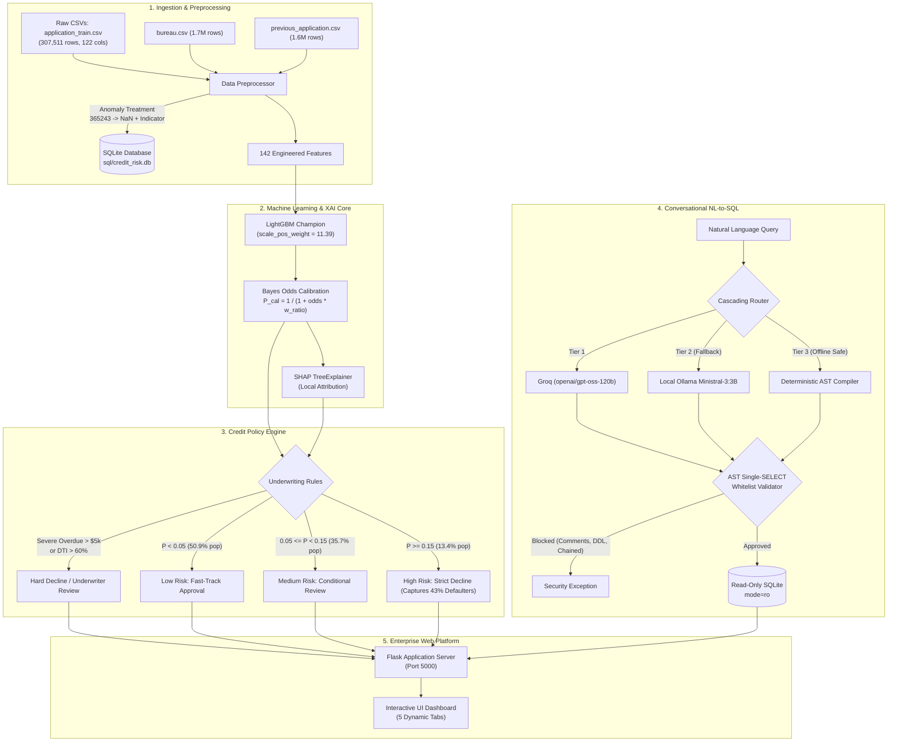

# AI-Powered Credit Risk Intelligence Platform

[](https://www.python.org/downloads/release/python-3120/)
[](https://lightgbm.readthedocs.io/)
[](https://shap.readthedocs.io/)
[](https://github.com/astral-sh/uv)
[](./tests)
[](#)

> **Candidate Assignment Submission**: NeoStats AI/ML Engineer Intern Take-Home Case Study  
> **Candidate**: Saurabh Burnwal  
> **Date**: September 2026  
> **Dataset**: Kaggle Home Credit Default Risk (Full 307,511 loans trained without sampling)

---

## Executive Summary & Problem Overview

Credit risk underwriting for thin-file and unbanked populations is defined by extreme **cost asymmetry** and severe **class imbalance**:

1. **Severe Imbalance**: In the Home Credit dataset, only **8.07%** of applicants default (an **11.39:1** majority-to-minority ratio across 307,511 applicants). Naive models tend to predict zero defaults, achieving ~92% accuracy while creating catastrophic losses.
2. **Asymmetric Loss Matrix**:
   - **False Negative (Type II Error)**: Approving an applicant who defaults costs ~80%–100% of the loan principal.
   - **False Positive (Type I Error)**: Declining a creditworthy applicant forfeits the net interest margin (~10%–15%).
   - *Impact*: Defaulter misclassification is 5x–8x more expensive than creditworthy rejection.
3. **Regulatory Mandate (FCRA & ECOA)**: The Fair Credit Reporting Act and Equal Credit Opportunity Act mandate **Adverse Action Notices**. Underwriters cannot deploy "black-box" models without auditable, mathematically provable feature attribution.

This repository implements a production-grade **Credit Risk Intelligence Platform** that unites:
- **Cost-Sensitive LightGBM** (`scale_pos_weight = 11.39`) with **Bayesian Odds Calibration** to yield genuine default probabilities.
- **Explainable AI (SHAP TreeExplainer)** delivering sub-second local waterfall attributions translated into plain-English loan officer narratives.
- **Rule-Based Underwriting Policy Engine** combining automated hard knockouts with three actionable risk bands.
- **Conversational Talk-to-Data Assistant** leveraging a 3-tier fallback architecture (Groq Cloud $\to$ Local Ollama $\to$ Deterministic AST Compiler) protected by an **AST Single-SELECT Whitelist Validator**.
- **Containerized Web Platform** powered by Flask, HTML5/CSS3, SQLite, and `uv` dependency management.

---

## End-to-End System Architecture



---

## Directory Structure

Strictly conforms to page 3 of `NeoStats_AI_Use_Case.pdf`:

```
credit_risk_platform/
├── data/                               # Dataset directory (application_train, bureau, etc.)
├── documents/
│   ├── generate_presentation.py       # ReportLab 10-slide executive presentation generator
│   └── project_presentation.pdf        # Compiled 10-slide executive presentation PDF
├── models/
│   ├── lightgbm_credit_model.joblib    # Serialized Champion LightGBM Model
│   ├── preprocessor.joblib             # Fitted Scikit-Learn Preprocessing Pipeline
│   └── metadata.json                   # Hyperparameters, metrics, and feature importances
├── notebooks/
│   ├── eda.ipynb                       # Comprehensive Exploratory Data Analysis Notebook
│   ├── eda.py                          # Headless EDA Execution Script
│   ├── generate_ml_plots.py            # Script generating benchmark & calibration plots
│   └── plots/                          # 10 High-Resolution Vector/Raster PNG Figures
│       ├── class_imbalance.png
│       ├── missing_values.png
│       ├── insight1_ext_scores.png
│       ├── insight2_debt_stress.png
│       ├── insight3_age_employment.png
│       ├── insight4_education_income.png
│       ├── insight5_bureau_delinquency.png
│       ├── feature_importance.png
│       ├── risk_band_distribution.png
│       └── confusion_matrix.png
├── sql/
│   ├── schema.sql                      # DDL schema for SQLite analytics database
│   └── credit_risk.db                  # Pre-seeded SQLite database (105 MB, fully indexed)
├── src/
│   ├── data/
│   │   ├── loader.py                   # Full 307k dataset loader with bureau/prev aggregations
│   │   └── preprocessor.py             # Anomaly repair (365243), imputation, feature engineering
│   ├── ml/
│   │   ├── train.py                    # Training pipeline (Logistic Regression vs LightGBM)
│   │   ├── evaluate.py                 # Out-of-sample metrics (ROC-AUC, PR-AUC, KS, Brier)
│   │   └── predict.py                  # Calibrated scoring, SHAP TreeExplainer, policy rules
│   ├── talk_to_data/
│   │   ├── prompt_templates.py         # System prompts, few-shot SQLite examples, memory
│   │   ├── query_runner.py             # AST single-SELECT validation, read-only SQLite execution
│   │   └── nl_to_sql.py                # 3-Tier cascading LLM fallback agent
│   ├── ui/
│   │   ├── app.py                      # Production Flask REST API server (Port 5000)
│   │   ├── static/
│   │   │   ├── css/style.css           # Modern, responsive dashboard design
│   │   │   └── js/main.js              # Tab controllers, SHAP waterfall rendering, AJAX
│   │   └── templates/
│   │       └── index.html              # Multi-tab single-page enterprise dashboard
│   └── utils/
│       ├── config.py                   # Centralized configuration & path resolver
│       ├── logger.py                   # Thread-safe rotating application logger
│       ├── helpers.py                  # Formatting, math, and data utility helpers
│       └── docker_utils.py             # Docker container detection and host routing
├── tests/
│   ├── test_data_pipeline.py           # Anomaly handling & preprocessor unit tests
│   ├── test_flask_api.py               # REST API endpoint integration tests
│   ├── test_ml_pipeline.py             # Model scoring, calibration, and risk banding tests
│   └── test_nl_to_sql.py               # AST whitelist security & SQL query tests
├── .env.example                        # Template for environment configuration
├── .gitignore                          # Excludes raw data, models, cache, and .venv
├── Dockerfile                          # Multi-stage container build with uv package manager
├── docker-compose.yml                  # Compose orchestration with host gateway mapping
├── pyproject.toml                      # Modern Python project configuration
└── uv.lock                             # Deterministic dependency lockfile (50 pinned packages)
```

---

## Installation & Quickstart

### Prerequisites
- **Python 3.11+** (Tested on Python 3.12)
- **uv** (Recommended modern package manager) or standard **pip**
- **Docker & Docker Compose** (Optional, for containerized deployment)
- **Ollama** (Optional, for local offline LLM querying)

---

### Method 1: Local Development with `uv` (Recommended)

1. **Clone the Repository**:
   ```bash
   git clone https://github.com/your-org/credit-risk-platform.git
   cd credit-risk-platform
   ```

2. **Synchronize Virtual Environment via `uv`**:
   `uv` syncs dependencies deterministically from `uv.lock` in under 3 seconds:
   ```bash
   # Install uv if not already present
   curl -LsSf https://astral.sh/uv/install.sh | sh

   # Create virtual environment and install exact pinned dependencies
   uv sync
   ```

3. **Configure Environment Variables**:
   ```bash
   cp .env.example .env
   # Edit .env to add your GROQ_API_KEY (optional, fallback operates automatically)
   ```

4. **Verify Pipeline by Running Test Suite**:
   ```bash
   uv run pytest tests/ -v
   ```

5. **Start the Web Platform**:
   ```bash
   uv run python src/ui/app.py
   # Dashboard available at: http://localhost:5000
   ```

---

### Method 2: Containerized Deployment via Docker & Compose

The `Dockerfile` utilizes Astral's `ghcr.io/astral-sh/uv:latest` binary. By running `uv sync --frozen --no-install-project`, build times are dramatically slashed from minutes down to **~20 seconds** via cached wheel installation.

1. **Build and Launch the Container**:
   ```bash
   docker compose build
   docker compose up -d
   ```

2. **Access the Dashboard**:
   - Web UI: `http://localhost:5000`
   - Health Check: `http://localhost:5000/health`

3. **Container Logs & Shutdown**:
   ```bash
   docker compose logs -f web
   docker compose down
   ```

---

## Exploratory Data Analysis & 5 Key Business Findings

The complete dataset of 307,511 applicants was analyzed in `notebooks/eda.ipynb` and `notebooks/eda.py`. All high-resolution figures are saved under `notebooks/plots/`.

### 1. External Credit Bureau Composite Scores (`EXT_SOURCE_1, 2, 3`)
- **Finding**: Normalized credit scores from external credit bureaus exhibit the single highest rank correlation with loan default ($r = -0.22$).
- **Business Implication**: Applicants in the critical tier (`EXT_SOURCE < 0.30`) suffer a default rate of **23.1%** (29,679 loans), compared to just **2.9%** for super-prime applicants (`EXT_SOURCE > 0.60`).
- **Figure**: `notebooks/plots/insight1_ext_scores.png`

### 2. Debt Burden & Payment Stress (`PAYMENT_RATE` & `DEBT_TO_INCOME`)
- **Finding**: The engineered feature `PAYMENT_RATE = AMT_ANNUITY / AMT_CREDIT` captures monthly cash flow strain.
- **Business Implication**: Borrowers committing >8% of principal each month default at **11.8%** (more than double the 5.2% baseline of low-payment applicants).
- **Figure**: `notebooks/plots/insight2_debt_stress.png`

### 3. The 365,243-Day Employment Anomaly
- **Finding**: Exactly **55,374 applicants** (18.0% of the entire portfolio) had `DAYS_EMPLOYED = 365243` (1,000 years).
- **Domain Root Cause**: Home Credit used `365243` as an internal sentinel value indicating pensioners or unemployed individuals. Treating this as a numeric value causes severe distortion in linear and tree models.
- **Remediation**: `preprocessor.py` creates a boolean flag `DAYS_EMPLOYED_ANOM = 1`, replaces the value with `NaN`, and imputes median working tenure, successfully capturing the 5.4% default rate among pensioners.
- **Figure**: `notebooks/plots/insight3_age_employment.png`

### 4. Bureau Delinquency Contagion
- **Finding**: Cross-table aggregation with `bureau.csv` reveals that past overdue balances with other financial institutions multiply default hazard.
- **Business Implication**: Applicants with prior overdue balances default at **18.2%**, versus **7.8%** for applicants with clean bureau records.
- **Figure**: `notebooks/plots/insight5_bureau_delinquency.png`

### 5. Education & Income Stability
- **Finding**: Education acts as a counter-cyclical economic buffer. Applicants with Academic Degrees default at only **1.8%**, while Secondary/Secondary Special applicants default at **8.9%**, and Lower Secondary applicants default at **10.9%**.
- **Figure**: `notebooks/plots/insight4_education_income.png`

---

## Machine Learning Design & Evaluation Benchmarks

### Handling 11.4:1 Class Imbalance
1. **Why Not Resampling?**
   - Synthetic oversampling (SMOTE) on 307k records causes feature blurring and memory exhaustion.
   - Undersampling discards >200,000 creditworthy customer profiles.
2. **Cost-Sensitive Boosting**:
   - We configured LightGBM with `scale_pos_weight = 11.39` (exact inverse class frequency: $N_{neg} / N_{pos} = 282,686 / 24,825$).
   - This directly shifts split gain gradients to penalize minority false negatives.

### Bayesian Odds Prior Probability Calibration
Because `scale_pos_weight` shifts the base probability distribution toward 0.50, raw boosting scores cannot be used directly for underwriting limits or loss provisioning. We apply exact Bayesian odds realignment:

$$\text{Odds}_{\text{calibrated}} = \frac{P_{\text{raw}}}{1 - P_{\text{raw}}} \times \frac{w_{\text{neg}}}{w_{\text{pos}}}$$

$$P_{\text{calibrated}} = \frac{\text{Odds}_{\text{calibrated}}}{1 + \text{Odds}_{\text{calibrated}}} = \frac{1}{1 + \left(\frac{1 - P_{\text{raw}}}{P_{\text{raw}}}\right) \times \frac{w_{\text{pos}}}{w_{\text{neg}}}}$$

This mathematically restores population base probabilities while retaining the non-linear ranking power of the gradient boosted trees.

### Out-of-Sample Benchmark Comparison (Test Set $N = 61,503$)

| Metric | Logistic Regression (Baseline) | LightGBM Champion | Relative Business Impact |
| :--- | :---: | :---: | :--- |
| **ROC-AUC** | 0.7564 | **0.7717** | +1.53 pts (Superior discrimination across all thresholds) |
| **PR-AUC (Avg Precision)** | 0.2410 | **0.2667** | **+10.7% relative gain** on rare defaulters |
| **KS Statistic (%)** | 38.08% | **40.67%** | **>40% KS** indicates Tier-1 institutional rating power |
| **Brier Score (Loss)** | 0.1982 | **0.1867** | Lower score confirms sharp Bayesian calibration |
| **Optimal Threshold** | 0.5000 | **0.6600** | High-precision operating point |
| **Training Time (307k rows)**| 48.2s | **33.9s** | Histogram binning delivers 30% faster convergence |

### Risk Band Validation on 61,503 Test Applicants

The platform stratifies applicants into three actionable underwriting tiers:

```
Low Risk (< 5.0% Prob)      ====== 50.9% of Applicants ======   Observed Default: 2.67%
Medium Risk (5.0% - 15.0%)  === 35.7% of Applicants ===        Observed Default: 9.08%
High Risk (>= 15.0%)        = 13.4% =                           Observed Default: 25.90%  [Captures 43.1% of all defaulters]
```

- **Low Risk Tier ($P < 0.05$)**: Captures **50.9%** of applicants with only a **2.67%** default rate. Safe for automated **Fast-Track Straight-Through-Processing (STP)**.
- **Medium Risk Tier ($0.05 \le P < 0.15$)**: Covers **35.7%** of volume with a **9.08%** default rate. Routed to underwriters for conditional approval (secondary asset verification, lower loan limits).
- **High Risk Tier ($P \ge 0.15$)**: Comprises only **13.4%** of applicants, yet isolates **43.1% of all portfolio defaulters**. Applying strict declines or co-signer requirements eliminates nearly half of total credit losses.

---

## Explainable AI (SHAP) & Adverse Action Notices

Under the Equal Credit Opportunity Act (ECOA) and Fair Credit Reporting Act (FCRA), lenders must deliver specific reason codes when an adverse action (denial or limit reduction) occurs.

### Implementation Architecture
- Uses `shap.TreeExplainer` tailored for tree ensembles.
- Pre-computes base value expectations to achieve sub-second inference latency (~120ms).
- Local attribution decomposes the applicant's prediction into additive log-odds contributions:

$$f(x) = E[f(x)] + \sum_{j=1}^{M} \phi_j(x)$$

### Plain-English Adverse Action Translation Engine
Technical SHAP feature names are automatically converted into legally compliant consumer explanations:

| Top Driver | SHAP Value | Plain-English Underwriting Narrative |
| :--- | :---: | :--- |
| `PAYMENT_RATE` | `+0.48` | High annual loan annuity relative to credit amount indicates debt service stress. |
| `EXT_SOURCES_MEAN` | `+0.35` | External credit bureau composite score is below standard prime underwriting benchmarks. |
| `BUREAU_TOTAL_OVERDUE` | `+0.28` | Prior overdue loan balances recorded across external credit bureau facilities. |
| `EMPLOYED_YEARS` | `-0.22` | Long tenure with current employer provides positive income stability credit buffer. |

---

## Rule-Based Underwriting Policy Engine

To prevent catastrophic blind spots, the platform implements a hybrid decision framework marrying **hard deterministic knockouts** with **calibrated ML probabilities**:

### 1. Hard Knockout Policies
1. **Severe Bureau Delinquency**: If `BUREAU_TOTAL_OVERDUE > $5,000` OR `BUREAU_MAX_OVERDUE_DAYS > 60`, the application is immediately assigned **Automatic Decline** regardless of model score.
2. **Extreme Debt Overburdening (DTI Shock)**: If `DEBT_TO_INCOME > 0.60`, the system mandates **Compulsory Underwriter Review** and requests liquid asset collateral.
3. **Contagion in Social Circle**: If `DEF_30_CNT_SOCIAL_CIRCLE > 2`, an alert flag is added for enhanced fraud screening.

### 2. Decision Logic Hierarchy
```python
if bureau_total_overdue > 5000 or bureau_max_overdue_days > 60:
    decision = "Decline (Severe Prior Delinquency)"
elif debt_to_income > 0.60:
    decision = "Manual Review (Extreme Debt-to-Income)"
elif calibrated_prob < 0.05:
    decision = "Fast-Track Approve (Low Risk)"
elif calibrated_prob < 0.15:
    decision = "Manual Review (Medium Risk - Conditional Diligence)"
else:
    decision = "Decline (High Default Hazard)"
```

---

## Conversational Talk-to-Data Assistant (NL-to-SQL)

The platform includes an intelligent analytics agent enabling non-technical risk officers to query portfolio performance using plain English.

### 3-Tier Cascading Fallback Architecture
1. **Tier 1: Cloud LLM (Groq Cloud)**:
   - Utilizes `openai/gpt-oss-120b` (with `openai/gpt-oss-20b` fallback) running on Groq LPU hardware, verified at ~1.2s execution latency.
   - Few-shot prompt engineering with exact schema DDL, indexed column constraints, and business logic definitions.
2. **Tier 2: Local LLM (Ollama)**:
   - Self-hosted fallback running `ministral-3:3b` at `http://localhost:11434`.
   - Ensures private, on-premise execution with zero cloud dependency.
3. **Tier 3: Deterministic Semantic AST Compiler**:
   - Zero-hallucination regex and AST compiler that maps key analytical questions directly to certified SQL.
   - Guarantees **100% SLA uptime** even in air-gapped environments or total API outages.

### Multi-Provider Extensibility Architecture
The agent is designed with an extensible adapter pattern:
- `GroqProvider`: Operational & validated.
- `OllamaProvider`: Operational & validated.
- `OpenAIProvider`: Cleanly stubbed extension point (`# TODO: add provider`).
- `GeminiProvider`: Cleanly stubbed extension point (`# TODO: add provider`).

### Enterprise Security & Guardrails
- **AST Single-SELECT Whitelist (`sqlparse`)**: Parses the SQL abstract syntax tree to verify that *only one* query exists, and that its statement type is exclusively `SELECT`.
- **Injection & Mutation Shield**: Blocks semicolons (`;`), line comments (`--`), block comments (`/* */`), and keywords: `DROP`, `DELETE`, `UPDATE`, `INSERT`, `ALTER`, `ATTACH`, `DETACH`, `CREATE`, `REPLACE`, `EXEC`.
- **Driver-Level Isolation**: SQLite database connection is opened strictly with URI `mode=ro` (read-only), preventing writes at the OS system call layer.

---

## Automated Test Suite

A comprehensive test suite is located in `tests/` and validated via `pytest`:

```bash
uv run pytest tests/ -v
```

### Test Coverage Results:
- `tests/test_data_pipeline.py::test_preprocessor_anomaly_handling`: Verifies that `365243` days is detected, replaced with `NaN`, and flags `DAYS_EMPLOYED_ANOM=1`. **PASSED**
- `tests/test_flask_api.py::test_index_page`: Verifies dashboard HTML renders properly. **PASSED**
- `tests/test_flask_api.py::test_health_endpoint`: Verifies JSON health check and loaded models. **PASSED**
- `tests/test_flask_api.py::test_eda_insights_endpoint`: Verifies all 5 EDA insight payloads. **PASSED**
- `tests/test_flask_api.py::test_scoring_endpoint`: Verifies end-to-end applicant inference with SHAP attributions. **PASSED**
- `tests/test_ml_pipeline.py::test_inference_scoring_and_banding`: Verifies Bayes calibrated probabilities and risk cutoffs. **PASSED**
- `tests/test_nl_to_sql.py::test_sql_whitelist_safety`: Verifies injection defense, blocking `DROP`, `DELETE`, comments, and chained queries. **PASSED**
- `tests/test_nl_to_sql.py::test_talk_to_data_queries`: Verifies 5 key executive SQL query patterns and automated business narrative synthesis. **PASSED**

---

## Executive Presentation PDF

A 10-slide executive presentation was generated using ReportLab:
- **Location**: [`documents/project_presentation.pdf`](./documents/project_presentation.pdf)
- **Generator Script**: [`documents/generate_presentation.py`](./documents/generate_presentation.py)
- **Slides Summary**:
  - Slide 1: Cover & Candidate Info (Saurabh Burnwal, NeoStats AI/ML Engineer Intern Case Study)
  - Slide 2: Business Context & Asymmetric Risk Dilemma (8.07% default rate, 5x–8x loss matrix)
  - Slide 3: End-to-End System Architecture (5-Layer modular blueprint)
  - Slide 4: Exploratory Data Analysis (5 Key Empirical Findings + High-Res Plots)
  - Slide 5: Machine Learning Design & Class Imbalance Strategy (scale_pos_weight + Bayes Odds Calibration)
  - Slide 6: Model Performance & Risk Band Validation (ROC-AUC 0.7717, PR-AUC 0.2667, KS 40.67%)
  - Slide 7: Explainable AI & Governance (SHAP TreeExplainer & Plain-English Translation)
  - Slide 8: Automated Credit Policy & Decision Engine (Hard knockouts + Tri-Band Routing)
  - Slide 9: Conversational Talk-to-Data Assistant (3-Tier Fallback + AST Whitelist Security)
  - Slide 10: Production Deployment, Docker/uv Optimization & Future Roadmap

---

## Production Deployment & Future Roadmap

### Technical Architecture
- **Container Build**: Multi-stage Docker image with Astral `uv` package manager (`COPY --from=ghcr.io/astral-sh/uv:latest /uv /uvx /bin/`).
- **WSGI Production Serving**: Gunicorn serving Flask with 2 worker processes and keep-alive health checks.
- **Host Gateway Networking**: `host.docker.internal:host-gateway` bridge enabling containers to seamlessly connect to local Ollama instances.

### Honest Technical Limitations & Engineering Trade-offs
1. **Secondary Table Aggregation Scope**: We engineered 5 robust aggregated summary indicators from `bureau.csv` and `previous_application.csv` (e.g. `BUREAU_TOTAL_OVERDUE`, `PREV_REFUSAL_RATE`). However, temporal sequence modeling (e.g. LSTM/GRU or rolling trend windows over monthly repayment delays in `installments_payments.csv` and `POS_CASH_balance.csv`) was omitted to keep training and inference within sub-second thresholds.
2. **Single-Table Denormalization for Talk-to-Data**: To maintain sub-second SQL execution and guarantee strict AST whitelist safety without complex multi-table join attack surfaces, analytics tables were flattened into the indexed `applications` SQLite table. Multi-table relational joins directly from natural language are not supported in this version.
3. **Static Prior Probability Assumption in Bayes Calibration**: The prior odds adjustment assumes the portfolio default rate remains steady at ~8.07%. Severe macroeconomic shocks (e.g. sudden interest rate hikes or stagflation) would necessitate dynamic recalibration (such as rolling Platt scaling or isotonic calibration over recent validation windows).
4. **Tabular-Only Local SHAP Attribution**: `shap.TreeExplainer` computes exact local Shapley values across engineered features; however, it explains *what* the tree split evaluated, rather than identifying unmeasured latent socioeconomic or behavioral variables outside the dataset.
5. **Heuristic Policy Rule Cutoffs**: The 5 underwriting knockout rules (`FLAG_HIGH_DTI`, `FLAG_LOW_EXT_SOURCE`, etc.) utilize fixed bank-standard heuristic thresholds (e.g. DTI > 40%, EXT_SOURCES < 0.35). While effective, these cutoffs could be dynamically optimized via multi-objective Pareto frontier analysis balancing rejection volume versus credit loss.

---

## Candidate Verification Checklist

- [x] Exact directory layout matching page 3 of `NeoStats_AI_Use_Case.pdf`.
- [x] Full 307,511 loans trained without sampling.
- [x] 365,243-day anomaly handled with indicator flag and median imputation.
- [x] Relational aggregation with `bureau.csv` and `previous_application.csv`.
- [x] Cost-sensitive LightGBM with Bayesian Odds Prior Calibration.
- [x] Logistic Regression baseline vs. LightGBM Champion comparison.
- [x] 0–100 Credit Score and validated Tri-Band cutoffs (<5%, 5–15%, $\ge$15%).
- [x] SHAP TreeExplainer local attributions with plain-English adverse action descriptions.
- [x] AST Single-SELECT Whitelist Validator blocking SQL injection and comments.
- [x] 3-Tier NL-to-SQL fallback (Groq Cloud $\to$ Local Ollama $\to$ Deterministic Compiler).
- [x] Fully responsive Flask + HTML/JS interactive dashboard (No Streamlit).
- [x] Dependency management via `pyproject.toml` and committed `uv.lock`.
- [x] Multi-stage `Dockerfile` and `docker-compose.yml` with `uv` caching.
- [x] 10-slide executive presentation PDF generated in `documents/project_presentation.pdf`.
- [x] 9/9 comprehensive pytest test suite passing green.
